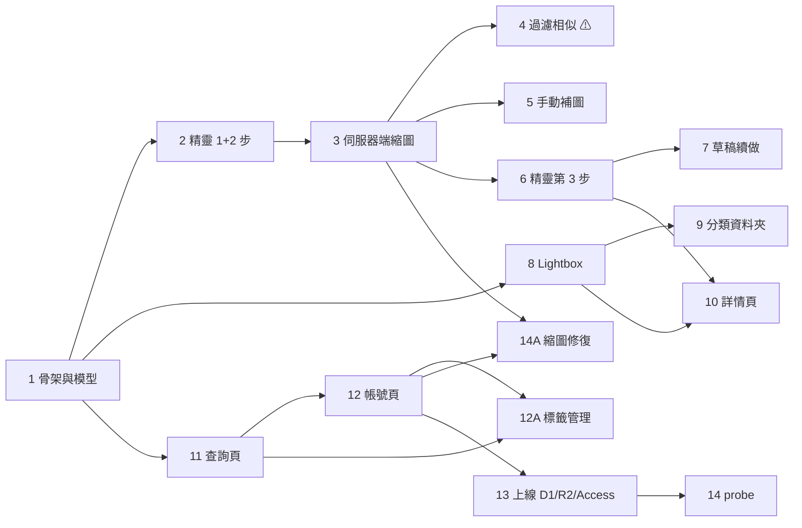

# yt-space Shot v1 · 實作計畫

> 建立日期：2026-09-01
> 基準規格：[`../specs/2026-08-27-yt-space-shot-design.md`](../specs/2026-08-27-yt-space-shot-design.md)
> 驗收標準：[`../../../mockups/uiux-v2/驗收操作手冊.md`](../../../mockups/uiux-v2/驗收操作手冊.md)
> 決策依據：[`../2026-09-01-uiux-v2-畫面契約與待決事項.md`](../2026-09-01-uiux-v2-畫面契約與待決事項.md)

## 詞彙

`shot` ＝ mockup 的 `clip`；`at_sec` ＝ mockup 的 `start`；`description` ＝ mockup 的 `summary` ＋ `note` 合併。
本計畫一律使用規格的詞。

---

## 〇、決定紀錄

| # | 決定 | 影響 |
|---|---|---|
| Q-1 | **Cloudflare Access ＋ Google IdP**，開啟 instant authentication | 站內登入頁不存在；`login.html`／`auth.js` 不移植；驗收手冊 §一 大部分失效（見第五節） |
| Q-2 | **第二步進場即收斂**（照手冊） | 階段 4 是最高風險任務，見 R-1 |
| Q-3 | **首頁固定三欄** | 不需要月份 shot 計數表；手冊 §二 第 1 條刪除 |
| Q-4 | **首頁卡片不顯示描述** | 列表 payload 不含 `description`；手冊 §二 第 2 條刪除 |
| Q-5 | **帳號頁維持原型版面**（漸層 hero ＋ 三格統計卡，比照 `account.html`） | 需要統計端點；手冊 §八 前兩條刪除 |
| Q-6 | **只做手機與平板**，不做桌機 | 保留 600px 加欄，不做 900px 置中限寬 |
| Q-7 | **命名為「帳號」`/account`** | 導覽列第五格文字由「設定」改為「帳號」；手冊 §零 第 1 條的用詞要更新 |
| Q-8 | **三段進度指示** | v2 加第四步時進度列要改版，已知並接受 |
| Q-9 | **設定值只存 localStorage** | 不建 `user_setting` 表；換裝置回預設值 |
| Q-10 | **標籤管理與縮圖修復都排進 v1** | 新增階段 12A 與 14A |
| Q-11 | **分類頁預覽拼貼與排序全做** | 階段 9 加大，見 R-3 |

### ⚠️ 兩條我在提問時漏掉、此處依規則推定的

這兩條沒有經過你確認。我把它們寫在最前面，翻掉的成本都是一個任務內的小改。

| # | 項目 | 推定 | 依據 |
|---|---|---|---|
| **D-4** | 首頁月份標籤：手冊要求「換行排列，不會橫向捲動被切在字中間」，原型 `styles.css:268-273` 是 `flex-wrap: nowrap` 橫向捲動 | **暫定維持原型的橫向捲動** | Q-3、Q-4 都選了原型現況，這條屬同一組首頁差異，方向一致。翻掉＝一行 CSS |
| **D-27** | 第三步時間欄位：手冊要求中性說明「預設帶入 YouTube 的日期，可以改成實際拍攝日」，**明確反對**欄位標題旁的橘色 ⚠ 警告；規格原文則要求 ⚠️ 提示且「視覺上比其他欄位更顯眼」 | **依手冊，用中性說明** | 規格在意的是「使用者要知道這可能不是拍攝日」，中性說明同樣達成。規格第五節已就地標 ⏳ 並列出兩案 |

### 另有一條互斥項未被提問，本計畫依規格處理

| # | 項目 | 處理 |
|---|---|---|
| **D-10** | 文字查詢：規格要 Gemini 解析 ＋ FTS5 ＋ 常駐「聽懂了：…」，且標籤與文字條件可並用；原型是描述子字串比對，且標籤／文字兩種模式互斥 | **依規格實作**（階段 11）。原型的模式互斥視為未實作到位，非設計決定。若你要的其實是原型那樣的簡單關鍵字比對，階段 11 可砍掉約一半 |

---

## 一、任務清單

階段編號沿用規格第十一節；`12A`、`14A` 是 Q-10 新增的兩段，插在依賴它們的階段旁邊，不改動原編號。

**規模基準**：S ≈ 半天～1 天，M ≈ 2～3 天，L ≈ 4 天以上。

### 階段 1 —— Turborepo 骨架與資料模型改名

`src/` 目前是 2026-08-07 clip 版的單一套件實作，這一階段把它搬進 monorepo 並換掉資料模型。

| # | 任務 | 規模 | 驗收 |
|---|---|---|---|
| T1.1 | 建立 pnpm workspace ＋ Turborepo：`apps/web`、`packages/storyboard`、`packages/schema`。現有 `src/` 移入 `apps/web`，`src/lib/storyboard.ts` 移入 `packages/storyboard` | M | `pnpm dev`、`pnpm check`、既有 unit test 全數通過 |
| T1.2 | Drizzle schema（`packages/schema`）：`video` / `shot` / `tag` / `shot_tag` / `folder` / `shot_folder` / `facet_month_agg` / `sb_probe`，欄位依規格第四節 | M | schema 與規格第四節逐欄位對得上；`ai_*` 欄位保留但 v1 不寫入 |
| T1.3 | `repo/{types,mock,d1}.ts` 介面重整，**所有方法必須帶 `owner_id` 參數**；`DATA_SOURCE=mock\|d1` 切換 | M | mock 與 d1 實作同一介面；`repo` 之外沒有任何直接碰 D1 的程式碼（規格第十八節邊界 1） |
| T1.4 | 首頁改接 `shot` 模型：依 `event_date` 年月分組、**固定三欄**、縮圖讀 `thumb_key` | S | 手冊 §二：「預設沒有時間篩選」「右上角日曆鈕 → 選一個月份 → 出現可清除的狀態列」「縮圖是 `<button>`，可以用 Tab 選到、Enter 打開」 |
| T1.5 | 查詢頁與詳情頁改接新模型（版面暫時不動，階段 10／11 再改造） | M | 兩頁在新模型上不報錯，既有 E2E 通過 |
| T1.6 | 移除 `/inbox` 路由、`api/clips`、`api/settings`、`status` 欄位相關程式碼 | S | 全專案 grep 不到 `clip`、`inbox`、`status` 的殘留 |

**平行性**：T1.1 完成後 T1.2／T1.3 可並行；T1.4–T1.6 卡在 T1.3。

---

### 階段 2 —— 精靈第一、二步

| # | 任務 | 規模 | 驗收 |
|---|---|---|---|
| T2.1 | `/capture` 路由與三段式步驟殼：`1. 貼網址 › 2. 挑畫面 › 3. 填資料`，已完成的步驟可點回去，支援 Android 返回鍵 | M | 手冊 §四：「**沒有底部導覽**，左上角是【✕】。三個步驟都一樣。」「進度指示**有文字**」「動詞統一：【下一步】→【下一步】→【完成】」 |
| T2.2 | 第一步網址解析：`youtu.be/`、`watch?v=`、帶 `&t=`、`shorts/`、純 videoId | S | 手冊 §四第一步：「亂打網址 → 錯誤訊息會說清楚該貼什麼格式。」規格第十二節 E2E 案例 1 |
| T2.3 | 第一步「最近取過的影片」清單 ＋ `GET /api/videos/recent`（由 `video` 表推導：`owner_id` ＋ `added_at` 排序 ＋ 該片 shot 數）**（D-15）** | S | 手冊 §四第一步：「歷史紀錄是**可點的清單列**（影片圖示＋標題＋日期＋張數），點了**直接進第二步**，不是只把網址填回輸入框。」 **這是新功能，不是照抄原型** —— 原型的清單存在 localStorage 且是寫死的種子資料 |
| T2.4 | 第二步縮圖牆：L3、每列 3 張、CSS `background-position` **直連 `i.ytimg.com`**（不經代理）、L2／L1 自動降級 ＋ 提示 | M | 規格第十二節 E2E 案例 2、19；手冊 §九：「縮圖仍取自 YouTube storyboard sprite」 |
| T2.5 | 第二步互動：點＝勾選、長按 0.5s＝跳播（震動 15ms）、**每格右上角 ▶**（D-20）、已收藏格鎖定並提示（D-19） | M | 手冊 §四第二步：「**每格右上角有一顆 ▶**，點了跳到那一段；長按仍然有效，但不是唯一入口 —— 鍵盤與輔助技術也要到得了。」「已收藏過的格子點下去會提示『這一格已經收藏過了』，不是靜靜地沒反應。」 **▶ 與提示在原型裡都還沒有**，是新做的 |
| T2.6 | 第二步工具列與底部列：全部選取／手動補圖／只看已選；底部單列計數 | S | 手冊 §四第二步：「工具列…**換行不截斷**，文字不會被切掉。」「底部只有**一列**：『N 張候選 · 已選 k』＋【下一步（k 張）】，底下不再疊導覽列。」 |
| T2.7 | 按【✕】離開的草稿確認 **（D-22）** | S | 手冊 §四：「第二／三步按【✕】→ 明確詢問『保留草稿並離開／捨棄草稿』，畫面上要說得出草稿還在不在。」 |

**依賴**：T2.4 卡在階段 3 的 `GET /api/video`（可先用 mock 的 `SB_SPECS` 開發，介面先定）。

---

### 階段 3 —— 伺服器端縮圖

| # | 任務 | 規模 | 驗收 |
|---|---|---|---|
| T3.1 | `GET /api/video/{videoId}`：Data API v3（`part=snippet,contentDetails,recordingDetails`）＋ storyboard 解析 ＋ **該片已收藏的 `frame_index` 清單** | M | 五種結果都有對應行為（規格第五節「第一步」表格）；無 storyboard 與解析失敗都**仍能進第二步**（E2E 案例 13） |
| T3.2 | `GET /api/sheet?u=` sheet 代理（只轉送位元組，不做影像處理） | S | 代理後 canvas 讀像素不拋 `SecurityError` |
| T3.3 | 前端裁切 ＋ `PUT /api/thumbs` → R2，key `{videoId}/L{level}/{frameIndex}.webp`，**已存在則跳過** | M | 同一支影片重複取到同一格不重複上傳；E2E：勾 3 張 → R2 出現 3 個物件 |
| T3.4 | 第三步進場的「處理縮圖 12/18」進度 | S | 進度可見；中途關閉分頁不會產生半套資料 |
| T3.5 | **sprite 回 403（簽章過期）時退回封面圖** **（D-18）** | S | 手冊 §九：「sprite 網址簽章過期時會退回封面圖，這是預期中的降級。」 **與「解不出 spec」是兩種不同的失敗**，兩者行為不同，規格第七節已分開定義 |

---

### 階段 4 —— 過濾相似（進場即收斂）⚠️ 最高風險

Q-2 選了「照手冊」。這一階段的實作方式與**判定退路**見 R-1。

| # | 任務 | 規模 | 驗收 |
|---|---|---|---|
| T4.1 | dHash：每格縮至 9×8 灰階 → 64-bit 指紋 → 漢明距離；門檻高 ≤10／中 ≤6／低 ≤3（暫定，待調校） | M | 單元測試：同一畫面距離 0；明顯不同場景距離 > 20 |
| T4.2 | **Web Worker 化**：sheet 批次下載（經 `/api/sheet`）＋ 離屏解碼 ＋ 指紋計算，不阻塞主執行緒 | L | 計算期間縮圖牆可正常捲動與點選 |
| T4.3 | 進場即收斂 ＋ 狀態列 ＋【顯示全部】／【重新過濾】切換 | M | 手冊 §四第二步：「**一進來就已經收斂過**：頂部狀態列顯示『已收斂成 50 張候選，隱藏了 98 張相似畫面』，而不是打開就是 148 格的候選牆。」「按【顯示全部】→ 148 張全出現，狀態列變成【重新過濾】，可以來回切。」 |
| T4.4 | 強度三檔沿用帳號頁設定（localStorage），切換後**對原始 148 格重算**（不是在已過濾結果上疊加） | S | 手冊 §四第二步：「收斂強度沿用『設定 › 取圖 › 過濾相似強度』（高／中／低）。」規格 E2E 案例 18 |
| T4.5 | **效能量測與退路判定**（見 R-1） | S | 產出一份實測數字；超過門檻則啟動退路並回報 |

**依賴**：T4.2 卡在 T3.2（代理）。T4.5 是這一階段的出口閘門，未做完不得進階段 5。

---

### 階段 5 —— 手動補圖

| # | 任務 | 規模 | 驗收 |
|---|---|---|---|
| T5.1 | 相簿／相機選圖 → canvas 縮至 480×270 webp → `PUT /api/thumbs`，key `{videoId}/manual/{uuid}.webp` | M | 上傳量約 20 KB；規格 E2E 案例 6 |
| T5.2 | 時間點帶入 `getCurrentTime()`（精確秒，可 ±1s 微調），產生 `source='manual'`、`frame_index=null` 的 shot 並插入縮圖牆正確位置 ＋「手動」小標記 | M | 補出的 shot 預設為已勾選 |
| T5.3 | 文案明說「圖只能由你自己提供」（系統無法從播放器截圖） | S | 規格第二節第 5 點：這條路完全沒有繞法，UI 不得讓使用者誤會 |

---

### 階段 6 —— 精靈第三步

| # | 任務 | 規模 | 驗收 |
|---|---|---|---|
| T6.1 | 4 欄縮圖網格 ＋ 綠點（已套用）＋ 快捷列（全選／全不選／反選／**未填的**） | M | 規格 E2E 案例 10 |
| T6.2 | 抽屜：時間／地點／標籤／描述；`〈多個值〉` 佔位；地點與標籤的既有值建議 | M | 規格 E2E 案例 9：只勾 1 張 → 抽屜顯示該張現有的值 |
| T6.3 | `POST /api/shots/batch`：**只帶動過的欄位，沒帶的伺服器不得寫入**；標籤整組覆蓋 | M | 手冊 §四第三步：「分兩輪套用仍然正確：先勾 8 張填一組 → 再勾另外幾張填另一組 → 前一輪不受影響。」規格 E2E 案例 7、8 |
| T6.4 | 主按鈕情境切換 ＋ 更新範圍提示 **（D-21）** | S | 手冊 §四第三步：「**主按鈕會變**：沒動過欄位時是【完成】；動了任一欄位就變成【套用到 N 張】。」「動過欄位時，按鈕上方出現『將更新：地點、標籤　其他欄位維持各張原值』」 |
| T6.5 | 時間欄位的中性說明 **（D-27，推定）** | S | 手冊 §四第三步：「時間欄位下方是中性說明『預設帶入 YouTube 的日期，可以改成實際拍攝日』，不是欄位標題旁邊的橘色 ⚠ 警告。」 |
| T6.6 | 底部單一 dock（抽屜＋按鈕合一）＋ 完成流程 | M | 手冊 §四第三步：「底部收成**同一塊 dock**…不是抽屜／按鈕列／導覽列三層把縮圖區壓到剩四成。」「【完成】→ 還有沒填的會提醒但不阻擋 → 回首頁、捲到該月份、toast『已新增 N 張』。」 |

---

### 階段 7 —— 草稿續做

| # | 任務 | 規模 | 驗收 |
|---|---|---|---|
| T7.1 | localStorage 草稿：`videoId`、步驟、已勾 `frame_index`、第三步已套用圖資、手動補圖 R2 key；**只記最近一支**，不上傳伺服器 | M | 規格 E2E 案例 12 |
| T7.2 | 【取圖】進入時的續做詢問：「上次《…》做到第 N 步，要繼續嗎？【繼續】【重新開始】」 | S | 選【繼續】回到原步驟與原選擇 |

---

### 階段 8 —— Lightbox

| # | 任務 | 規模 | 驗收 |
|---|---|---|---|
| T8.1 | 全屏檢視器：不透明背景、大圖 `object-fit: contain`、左右滑動（範圍＝進來時的清單）、「第 N / 共 M 張」 | M | 手冊 §三：「**背景是不透明的**，底層的月份標題與縮圖不會透出來。」「上方顯示『第 N / 共 M 張』。」 |
| T8.2 | 一次性滑動提示 | S | 手冊 §三：「第一次開啟會出現一次性的『左右滑動看上一張／下一張』提示。」 |
| T8.3 | 動作分層：主要【播放這一段】＋ 兩顆圖示鈕（加入分類／分享）＋ `⋯` 收編輯與刪除 | M | 手冊 §三：「動作**分層**…**刪除不該跟瀏覽動作並排**。」 **與規格第六節的六動作平鋪不同**，依手冊。按鈕文案沿用手冊的【播放這一段】（D-11） |
| T8.4 | 分享：Web Share API `https://youtu.be/{videoId}?t={at_sec}`；不支援退回複製連結 ＋ toast | S | — |
| T8.5 | 刪除單張：連動 `shot_tag`、`shot_folder`、`facet_month_agg` 遞減、R2 物件；該片最後一張時順帶刪 `video` 列；刪除後自動滑下一張 | M | 規格 E2E 案例 20、26 |

---

### 階段 9 —— 分類資料夾（Q-11：全做）

| # | 任務 | 規模 | 驗收 |
|---|---|---|---|
| T9.1 | `folder` / `shot_folder` CRUD：樹狀、**深度上限 5**、同層不可重名、長度上限 50 | M | 規格 E2E 案例 25：已在第 5 層 → 不能再建子層（UI 阻擋） |
| T9.2 | 資料夾清單頁：樹狀縮排、**含子孫層計數**（遞迴 CTE ＋ join 聚合） | M | 規格第六節；原型目前是平面清單，**樹狀縮排是新功能** |
| T9.3 | **內容預覽拼貼（最多 4 張）** —— 列表端點一次回傳每個資料夾的前 4 個 `thumb_key`，需避免 N+1 **（見 R-3）** | M | 手冊 §六：「每張資料夾卡片有**內容預覽拼貼**（最多 4 張）；空的資料夾顯示『還沒有圖片』。」 |
| T9.4 | 篩選字串 ＋ 4 種排序（名稱升／降、張數多→少、最近加入） | S | 「張數多→少」需先算全樹計數再排序，見 R-3 |
| T9.5 | 卡片操作入口：右下可見的 `⋯`（改名／刪除），長按保留 | S | 手冊 §六：「卡片右下有一顆看得見的 `⋯`（改名／刪除）；長按仍然有效，但不是唯一入口。」 |
| T9.6 | 空狀態 | S | 手冊 §六：「沒有任何資料夾時，空狀態帶一顆【新增資料夾】，不是只有一句灰字。」 |
| T9.7 | 資料夾內容頁：上半子資料夾、下半本層的圖（`shot_folder(folder_id, added_at)` keyset） | M | 點圖開 Lightbox，滑動範圍＝該資料夾本層的圖 |
| T9.8 | Lightbox【加入分類】bottom sheet：勾選即加入／移出，關閉即生效，可直接【＋新增資料夾】 | M | 規格 E2E 案例 23 |
| T9.9 | 刪除資料夾：連子資料夾與所有關聯一併刪，**圖本身不動**，確認框明示範圍 | S | 規格 E2E 案例 24 |

---

### 階段 10 —— 詳情頁改造

| # | 任務 | 規模 | 驗收 |
|---|---|---|---|
| T10.1 | 真 YouTube iframe，`?start={at_sec}`，**不設 `end`**；移除【標記此刻】FAB | S | 規格第八節 |
| T10.2 | 播放器下方顯示目前這張的圖資 ＋【編輯這張的圖資】 **（D-24）** | M | 手冊 §七：「播放器下方顯示**目前這一張的圖資**：描述、地點與標籤 chips、日期、影片秒數，以及一顆【編輯這張的圖資】—— 縮圖下方不該是大片空白。」 |
| T10.3 | 收藏縮圖網格：右上編輯鈕，點＝跳播、長按＝編輯 | S | 手冊 §七：「收藏縮圖右上角有**編輯鈕**；點縮圖＝跳播放，長按＝編輯（仍保留）。」 |
| T10.4 | 就地編輯 bottom sheet（與 Lightbox 共用同一元件） | M | 「我的標記」改名為「這支影片的收藏」 |
| T10.5 | `⋯` 三動作：繼續取這支的圖／批次編輯圖資（複用第三步介面）／刪除整支收藏 | M | 規格 E2E 案例 21、22 |

**依賴**：T10.4 與 T8.3 共用元件，兩者其一先做、另一方複用。T10.5 的「批次編輯」直接複用階段 6 的第三步介面，**不另做一套批次編輯 UI**。

---

### 階段 11 —— 查詢頁

依規格處理 D-10（見第〇節）。

| # | 任務 | 規模 | 驗收 |
|---|---|---|---|
| T11.1 | `GET /api/facets?upTo=`：一次回傳 tag ＋ place 兩種 facet 與計數，top-30 ＋「顯示更多」 | M | 規格第六、八節 |
| T11.2 | 地點與標籤混排同一條輪播，以顏色與圖示區分 | S | 手冊 §五：「每個標籤 chip **帶張數**；選取後除了變色還會**多一個打勾**（不只靠顏色編碼）。」 |
| T11.3 | 條件與結果同頁切換 ＋ 返回鍵改條件 | M | 手冊 §五：「**條件與結果在同一頁**：選完標籤按【查詢 N 個條件】→ 同頁換成結果，左上角出現返回鍵可以改條件，不會跳到另一個獨立頁面。」「按鈕文字會跟著選取數量變：【查詢 3 個條件】。」 |
| T11.4 | 停用原因說明 ＋ 結果列 | S | 手冊 §五：「按鈕停用時，下方會說**為什麼**：『先選一個以上的標籤或地點』，不是只把按鈕變淡。」「結果列顯示『N 張 · 全部日期 · 條件 chips』。」 |
| T11.5 | 首頁月份標籤帶入條件與時間並直接顯示結果 | S | 手冊 §五最後一條 |
| T11.6 | FTS5（**trigram** tokenizer）索引 `description` ＋ `place` | M | 中文檢索品質可接受 |
| T11.7 | Gemini Flash 查詢解析 ＋ 失敗退回規則式關鍵字切分 ＋ 相關度排序（place > tag > FTS） | L | 規格第八節 |
| T11.8 | 常駐「聽懂了：加勒比海・夜潛・大蝦　[修改]」 | S | 規格第八節。**原型沒有這個，是新功能** |
| T11.9 | 結果 keyset 分頁（50 筆／頁） | S | 規格第八節「規模化」 |

---

### 階段 12 —— 帳號頁

Q-5：版面比照原型 `account.html`。Q-7：命名「帳號」`/account`。Q-9：設定值存 localStorage。

| # | 任務 | 規模 | 驗收 |
|---|---|---|---|
| T12.1 | `/account`：漸層 hero ＋ 三格統計卡（比照 `account.html`），導覽列第五格文字改為**「帳號」** | S | 手冊 §零第 1 條的用詞同步更新為「首頁／查詢／取圖／分類／帳號」 |
| T12.2 | `GET /api/stats`：收藏張數、本月新增、來源影片數 | S | 「本月新增」以 `event_date` 年月比對，與首頁分組同一口徑；走 `shot(owner_id, event_date, id)` 索引，**不需要彙總表** |
| T12.3 | 細項頁 `/account/[section]`：取圖（過濾相似強度）／標籤管理／AI 分析／縮圖服務 | M | 手冊 §八：「**圖示對得上語意**：取圖＝漏斗、標籤管理＝標籤、AI 分析＝星芒、縮圖服務＝圖片。同一個圖示不會出現在兩個不同語意的地方。」「各細項頁的說明文字是**這個設定會影響什麼**，不是操作教學句。」 |
| T12.4 | 過濾相似強度與 AI 前後秒數存 localStorage（**AI 區間顯示但不生效**，標示「第四步上線後生效」） | S | 原型的 AI 秒數目前重整就回預設，**要修成真的存得住** |
| T12.5 | 【登出】→ `/cdn-cgi/access/logout`，置於最底、破壞性樣式 | S | 手冊 §八：「【登出】移到最底、用破壞性樣式。」 |

---

### 階段 12A —— 標籤管理後端（Q-10 新增）

| # | 任務 | 規模 | 驗收 |
|---|---|---|---|
| T12A.1 | `GET /api/tags`：全部標籤 ＋ kind ＋ 使用張數 | S | 原型 `setting.html` 的清單改讀真資料 |
| T12A.2 | `PATCH /api/tags/{id}`：改名／改 kind／編輯 aliases；**同名合併**的處理（改成既有名稱時合併兩者的 `shot_tag`） | M | 改名後查詢頁與首頁標籤列同步更新 |
| T12A.3 | `DELETE /api/tags/{id}`：解除所有 `shot_tag` 關聯 ＋ **同步遞減 `facet_month_agg`**，圖本身不刪 | M | 手冊 §八細項頁：「刪除只解除關聯，圖不會被刪。」 刪除後輪播計數正確 |

**依賴**：卡在階段 12（細項頁殼）與階段 11（`facet_month_agg` 已在用）。

---

### 階段 13 —— 上線：D1 ＋ R2 ＋ 網域 ＋ Access

| # | 任務 | 規模 | 驗收 |
|---|---|---|---|
| T13.1 | D1 migrations ＋ `repo/d1.ts` 實作 ＋ FTS5 trigram 虛擬表 ＋ 全部索引（規格第四節） | L | mock 與 d1 兩種 `DATA_SOURCE` 下 E2E 皆通過 |
| T13.2 | R2 綁定；縮圖讀寫收斂在 `/api/thumbs` 與單一 storage 模組內（規格第十八節邊界 2） | M | grep 不到散落各處的 R2 呼叫 |
| T13.3 | Workers Custom Domain `shots.scottchayaa.com` | S | — |
| T13.4 | Cloudflare Access ＋ Google IdP，**開啟 Apply instant authentication**（單一 IdP，跳過 Access 登入頁直接進 Google） | M | 未登入開任何路徑都被擋在邊緣；深連結登入後正確回到原路徑 |
| T13.5 | `auth.ts`：以 `ctx.access.getIdentity()` 取 email 與 name 當 `owner_id`（**不需自行驗 JWT**）。認證邏輯只在這一個檔案（規格第十八節邊界 3） | S | 帳號頁的名稱／Email／頭像字母來自登入狀態，不是寫死 |
| T13.6 | **API 客戶端統一加 `X-Requested-With: XMLHttpRequest`**，session 到期時接到 401 → 強制刷新而非拿到 HTML | M | 模擬 session 過期 → 不會出現「畫面隨機壞掉」 |
| T13.7 | **PWA standalone 下的跨網域轉跳實機驗證**（Android） | S | 見 R-4 |
| T13.8 | `wrangler.jsonc` 的 `access.dev` 區塊，讓 `wrangler dev` 與 Playwright 能假裝已登入 | S | E2E 不被登入閘門擋住 |

---

### 階段 14 —— apps/probe

| # | 任務 | 規模 | 驗收 |
|---|---|---|---|
| T14.1 | `apps/probe` Cron Worker 骨架，綁同一個 D1／R2，共用 `packages/storyboard` | M | probe 測的就是主站實際在跑的那份解析程式碼 |
| T14.2 | 失敗分類：`ok` / `no_storyboard` / `parse_failed` / `fetch_failed`（靠 `playabilityStatus`、`lengthSeconds` 錨點區分前兩者） | M | 規格 E2E 案例 15：模擬 `no_storyboard` 連續發生 → **不寫入告警紀錄** |
| T14.3 | 每日金絲雀探測（需先選定一支長期存在、確定有 storyboard 的公開影片） | S | 規格第十六節開放項：金絲雀影片選定後寫入設定常數 |
| T14.4 | 告警：D1 紀錄 ＋ Workers Logs 結構化輸出 ＋ `send_email` binding 寄信 | M | 規格 E2E 案例 16（probe 單元測試）。前置：`scottchayaa.com` 需啟用 Email Routing 並驗證收件位址 |
| T14.5 | 每日孤兒縮圖清理（超過 7 天未被任何 shot 引用的手動補圖） | S | — |

---

### 階段 14A —— 縮圖修復（Q-10 新增）

⚠️ **這一段有個容易被誤解的結構限制**：裁切一律在瀏覽器（規格第三節原則 4），
所以「補抓缺少的縮圖」**不能在 Worker 或 probe 裡跑**，只能在使用者開著的分頁裡進行。
規格第十一節的階段 14A 已記載這條限制。

| # | 任務 | 規模 | 驗收 |
|---|---|---|---|
| T14A.1 | `GET /api/thumbs/missing`：列出 `thumb_key` 為空、或 R2 物件不存在的 shot（含其 `video_id` 與 `frame_index`） | M | 帳號頁「目前沒有缺少的縮圖」／「有 N 張缺少縮圖」顯示正確 |
| T14A.2 | 【重新抓取缺少的縮圖】：**前端驅動的循序補抓** —— 逐支影片重取 `sb_spec` → 代理下載 sheet → 裁切 → 上傳，顯示進度並明確告知**分頁需保持開啟** | L | 手冊 §八細項頁：「縮圖來源暫時失效時收藏的影片，可以在這裡補抓」 中途關閉分頁不產生半套資料，可續做 |
| T14A.3 | 影片的 `sb_spec` 已失效（該影片現在也解不出來）時的處理：跳過並回報，不阻塞其餘 | S | 補抓不會因為單支影片失敗而整批中斷 |

**依賴**：卡在階段 3（代理與裁切）與階段 12（細項頁）。與階段 14 無強依賴，但概念上成對。

---

## 二、依賴關係

**可平行的三條線**（階段 1 完成後）：

| 線 | 內容 | 說明 |
|---|---|---|
| A（主線） | 2 → 3 → 4 → 5 → 6 → 7 | 取圖精靈，最長、風險最高，優先配人 |
| B | 8 → 9 ／ 8 → 10 | 瀏覽與策展，與 A 幾乎無交集 |
| C | 11 → 12 → 12A | 查詢與帳號 |

**交會點**：階段 10 的【批次編輯圖資】要複用階段 6 的第三步介面 —— **A 線的階段 6 必須早於 B 線的階段 10**。
階段 8 與階段 10 共用就地編輯元件，先做的那個負責把元件抽出來。

階段 13 是所有線的匯流點，13 之前全部跑在 mock 上。

---

## 三、風險

### R-1 ⚠️ 進場即收斂的效能（Q-2 = ①）

**風險**：進第二步時必須把約 17 張 sheet 全部經 Worker 代理下載、解碼、算 148 次 dHash，才畫得出「已收斂成 50 張候選」的畫面。
規格原本的設計是「只比對已勾選的，不比對全部 148 張」，那條約束正是為了避免這個成本；Q-2 選 ① 推翻了它，規格第五節已同步改寫並把舊設計保留為本風險的退路。

**實作方式（把風險壓到最低）**：縮圖牆**先直連 `i.ytimg.com` 立刻畫出 148 格**（不等 dHash），
收斂在 Web Worker 背景算完之後才套用，狀態列從「載入中」變成手冊要求的文案。
這樣即使計算慢，使用者也不是對著白畫面等。

**判定時機**：**T4.5，階段 4 的最後一個任務**。

**量測**：Pixel 7 ＋ Chrome DevTools 4G 節流，取三支代表性影片（短 ~5 分、中 ~15 分、長 ~25 分），
各跑 5 次，記錄「進入第二步 → 收斂完成」的時間，取 p75。

**門檻與退路**：

| p75 | 動作 |
|---|---|
| ≤ 3 秒 | 維持進場即收斂，不動 |
| 3–5 秒 | 維持，但加上骨架態與「正在過濾相似畫面…」的明確進度 |
| **> 5 秒** | **退回規格原設計**：改為【過濾相似】按鈕觸發、只比對已勾選的。手冊 §四第二步的 3 條驗收項改寫，狀態列文案作廢 |

**已下載的 sheet 不會白費** —— 第二步按【下一步】時本來就要用它們裁圖。

### R-2 縮圖補抓只能在瀏覽器（階段 14A）

裁切一律在瀏覽器是規格的硬約束（不引入 Worker 影像相依、維持零成本）。
因此補抓是**前端驅動的長時作業**，分頁關掉就中斷。

**退路**：作業設計成可續做（每張補完即入庫，不做全有全無的交易），
使用者關掉分頁再回來按一次，從剩下的繼續。**判定時機**：T14A.2 設計評審時確認可續做，不留到實作後。

### R-3 分類頁預覽拼貼與排序的查詢成本（階段 9）

清單頁一次要 N 個資料夾 × 前 4 個 `thumb_key`，加上「張數多→少」排序需要先算出全部資料夾的含子孫計數。
資料夾數在數百量級時，天真作法是 N+1 查詢。

**判定時機**：**T9.3 實作完成當天**，以 200 個資料夾的種子資料量測清單頁 API 回應時間。

**門檻**：> 300 ms 就改用單條 window function 查詢（每個資料夾取前 4 筆）；
仍然不行則比照 `facet_month_agg` 加一張資料夾封面彙總表，**資料模型不動**。

### R-4 PWA standalone 下的 Access 跨網域轉跳（T13.7）

Access 的認證會跳到 `cloudflareaccess.com` 與 `accounts.google.com`。
Android 上 standalone 模式的 PWA 遇到跨網域轉跳，可能跳出應用視窗或開成 Custom Tab。

**判定時機**：**T13.7，Access 一掛上就測**，不要等到全部做完。
**退路**：若體驗不可接受，manifest 的 `display` 由 `standalone` 降為 `minimal-ui`（保留網址列，轉跳不破窗）。

### R-5 storyboard 是非官方端點

規格第七節已完整處理（降級不當機、金絲雀探測、告警）。此處只記一條計畫面的要求：
**階段 2、3 的降級路徑必須有測試覆蓋**（規格 E2E 案例 13、17），不能等到階段 14 才驗證。

### R-6 `recordingDetails` 的可及性（規格第十六節開放項）

以 API key（非 OAuth）呼叫 `videos.list?part=recordingDetails` 時，對他人的公開／unlisted 影片是否回傳該欄位，尚未驗證。

**判定時機**：**T3.1 的第一天**，一支測試影片打一次 API 就知道。
**退路**：不可得則 `event_date` 預設值鏈直接退到 `published_at`，UI 行為不變（第三步本來就可改）。

---

## 四、明確不做

### 因本次決定而排除

| 項目 | 依據 |
|---|---|
| 首頁欄數隨當月張數變 | Q-3 |
| 首頁卡片顯示描述 | Q-4 |
| 帳號頁改成一行帳號列（維持漸層 hero ＋ 三格統計卡） | Q-5 |
| 桌機版面（900px 以上置中限寬） | Q-6 —— **平板 600px 加欄仍要做** |
| 設定值跨裝置同步（`user_setting` 表） | Q-9 |
| 站內 Google 登入頁 | Q-1 |

### 規格第十五節既有的排除

第四步 AI 補充圖資（v2 確定要做）、桌機版面、Chrome 擴充功能、YT App 分享接收（Share Target）、
上傳非影片畫面的實體照片、資料夾搬移與手動排序、整片掃描、iOS 支援、向量搜尋（Vectorize）、
本機 pipeline、使用者自帶 Gemini 金鑰、Google Drive ＋ DuckDB 取代 D1/R2（永不做）。

### 視覺回歸測試

規格第十二節：v1 不做 screenshot diff。UI 仍在快速變動，導入只會把時間耗在核可 baseline。

---

## 五、驗收操作手冊的更新（✅ 已於 2026-09-01 完成）

選了 Cloudflare Access 之後，測試人員照原手冊驗會有一整節 fail —— 那不是 bug，是手冊過期。
下列增刪**已經套用到 `驗收操作手冊.md`**，本節保留為對照紀錄，說明每一條為什麼變。

### §一 登入 —— 整節重寫

| 現行條目 | Access 下的狀況 |
|---|---|
| 未登入時開任何一頁都會被擋、不該先閃一下再跳走 | ✅ **保留並加強** —— 擋在邊緣，連 HTML 都送不出來 |
| 登入後回到原本要去的地方 | ✅ **保留** —— Access 的 `redirect_url` 內建 |
| 已經登入就看不到登入頁 | ✅ **保留** —— 我們沒有登入頁 |
| 設定頁的帳號來自登入狀態 | ✅ **保留** —— 改為驗證來自 `getIdentity()` |
| 登出會真的回到登入頁 | ✅ **保留** —— 改為驗證 `/cdn-cgi/access/logout` |
| 深色模式下這一頁要能讀 | ✅ **保留** —— Access 登入頁已支援深色模式 |
| 只有一顆按鈕、沒有帳密欄位 | ❌ **刪除** —— instant authentication 下沒有這一頁 |
| 頁面上幾乎沒有字 | ❌ **刪除** —— 同上 |
| Google 按鈕是中性底色＋彩色 G | ❌ **刪除** —— 版面不是我們的 |
| 按下去有「登入中」的過場 | ❌ **刪除** —— 沒有這個環節 |

**新增條目**：開站後應直接看到 Google 帳號選擇器（不經過中間頁）；不在允許名單的帳號應看到阻擋頁。

### 其他需要改的條目

| 節 | 條目 | 動作 |
|---|---|---|
| §零 | 「底部導覽有文字：首頁／查詢／取圖／分類／**設定**」 | 「設定」改為「**帳號**」（Q-7） |
| §零 | 「600px 以上會加欄、**900px 以上置中限寬**」 | 刪除後半（Q-6，不做桌機） |
| §二 | 「欄數會跟著當月張數變」 | **刪除**（Q-3） |
| §二 | 「卡片上看得到描述」 | **刪除**（Q-4） |
| §二 | 「月份標籤換行排列」 | **刪除**（D-4 推定，維持橫向捲動） |
| §八 | 「沒有紫色漸層 header，也沒有三格統計卡」 | **刪除**（Q-5） |
| §八 | 「改成一行帳號列＋一句『目前收藏 13 張…』」 | 改為驗證三格統計卡的數字正確（Q-5） |

### 手冊已經對、但原型還沒做到的（實作時不要照抄原型）

| 項目 | 證據 |
|---|---|
| 首頁月份標籤是否換行 | 手冊要換行，`styles.css:268-273` 是 `nowrap` —— 本計畫依 D-4 推定維持 nowrap，**手冊改成配合原型** |
| 分類頁樹狀縮排 | 原型 `folders.html` 是平面清單，mock 資料沒有子資料夾 |
| 分類頁預覽是拼貼還是幻燈片 | 手冊寫「拼貼（最多 4 張）」，原型 `folders.html:100-113` 是兩層交替淡入的幻燈片 —— **依手冊做拼貼** |
| 查詢頁的文字查詢 | 原型是子字串比對且與標籤模式互斥；本計畫依規格做 Gemini 解析 ＋ 可並用（D-10） |
| 登入後回原頁 | 原型 `login.html:58` 用了未宣告的 `back` 變數，實際會拋 `ReferenceError` —— 該檔案不移植，此條由 Access 內建滿足 |
