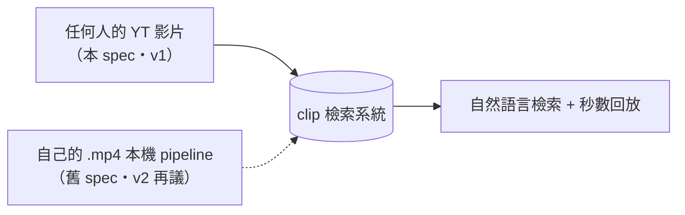
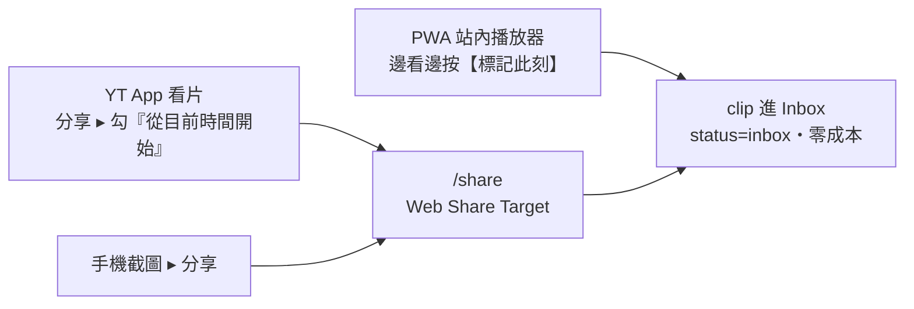
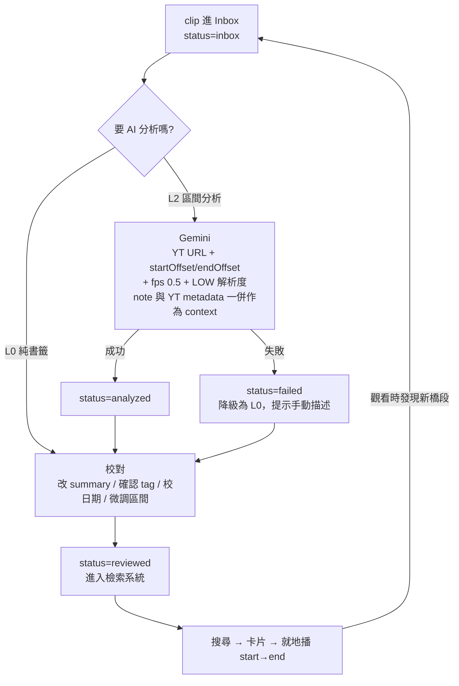

# yt-space Clip 設計規格書

> 任何 YouTube 影片的片段標記與語意化檢索系統（手機優先）
> 建立日期：2026-08-07
> 狀態：設計確認中（待使用者複審）

---

## 〇、本文件的定位

本文件是 **yt-space 的新 v1**，取代 [`2026-07-30-yt-space-design.md`](2026-07-30-yt-space-design.md) 成為優先實作的目標。

兩份規格的關係：

| | 舊 spec（2026-07-30） | 本 spec（2026-08-07） |
|---|---|---|
| 影片來源 | **自己**的本機 `.mp4` | **任何人**的 YouTube 影片 |
| 片段從哪來 | pipeline 自動切段 | **人主動標記** |
| 重運算 | 本機 ffmpeg + whisper.cpp | **無**（Gemini 直接吃 YouTube URL） |
| 主要裝置 | 桌機 | **手機** |
| 狀態 | **已擱置，v2 再議** | **實作中的 v1** |

兩者是同一個檢索系統的**兩條 ingestion 來源**，共用資料模型與檢索邏輯：



舊 spec 的 `segment` 未來直接寫進同一張 `clip` 表，靠 `origin` 欄位區分，**不需要資料遷移**。

---

## 一、需求分析

### 1. 核心目標

在**瀏覽任何 YouTube 影片**時，能一鍵記下有意義的時間片段，交給 AI 轉成可檢索的語意資訊，人工校對後存入個人檢索系統。之後能用自然語言（關鍵字＋日期）找回這些片段，並跳到原影片的精確秒數回放。

### 2. 三個目標情境

**情境 A —— 隨手蒐集**
瀏覽 YT 時發現有趣橋段，一鍵記下該時間點，AI 分析成 tag 與語意描述，人工校對後入庫。因為不限於自己的影片，可以到處蒐集截錄，整理成「屬於自己的、某段時間內發生的重要事件」。

**情境 B —— 他人上傳的共同回憶**
朋友把共同出遊的影片放上 YouTube，同樣能標記其影片的時間點入庫。日後用關鍵字或遊玩日期，就能找回自己或朋友上傳的相關畫面，短片回放或連回 YT 原片觀看。**觀看過程中發現其他值得節錄的片段，可以當場動態新增。**

**情境 C —— 節省 AI 分析資源**
不必對整支影片分析，只挑選感興趣的區間送 AI，擷取有用的 tag 與語意。

### 3. 功能需求

- **一鍵標記**：看片過程中以最低的操作成本記下時間點，不打斷觀看心流。
- **區間分析**：只分析選定區間，不浪費 AI 配額。
- **語意化**：AI 產出摘要、逐字內容、畫面描述、分類標籤。
- **人工校對**：所有 AI 產出的欄位皆可修改，且可還原成 AI 原版。
- **自然語言檢索**：支援關鍵字＋日期區間＋標籤過濾。
- **秒數級回放**：結果卡片就地播放該區間，或連回 YouTube 原片。
- **手機優先**：主要操作場景是手機（Android）。

### 4. 產品定位

多租戶（multi-tenant）個人工具。每個使用者管理自己私人的片段收藏，`owner_id` 從第一天就存在。v1 只服務作者本人，但認證機制天生支援多人（見第九節）。

---

## 二、已實測驗證的技術事實

> 以下均為 2026-08-07 實際發出請求驗證的結果，非推測。**這些是整份設計的地基。**

### 1. Gemini 對 YouTube 影片的可及性

| YouTube 隱私設定 | 中文介面 | 匿名可及 | Gemini 可分析 | 驗證方式 |
|---|---|---|---|---|
| public | 公開 | ✅ | ✅ | oEmbed HTTP 200 |
| **unlisted** | **不公開** | ✅ | ✅ **實測通過** | `playabilityStatus: OK`；Gemini 正確回傳該區間描述 |
| private | 私人 | ❌ | ❌ | `playabilityStatus: LOGIN_REQUIRED`「這是私人影片」 |

**關鍵原理：Gemini 以 API key 呼叫時，身分是匿名訪客，身上沒有使用者的 YouTube 帳號。** 因此「這是我自己的影片」對 Gemini 沒有意義 —— private 影片即使是本人上傳也讀不到。

> **產品規則：所有要進入本系統的影片，隱私設定必須是「公開」或「不公開」，不能是「私人」。**

### 2. Gemini 區間分析的實測參數與成本

實測請求（`gemini-flash-latest` → 實際解析為 `gemini-3.6-flash`）：

```json
{
  "contents": [{
    "parts": [
      { "fileData": { "fileUri": "https://youtu.be/{videoId}" },
        "videoMetadata": { "startOffset": "5s", "endOffset": "20s", "fps": 0.5 } },
      { "text": "..." }
    ]
  }],
  "generationConfig": { "mediaResolution": "MEDIA_RESOLUTION_LOW" }
}
```

實測回傳的 `usageMetadata`：

```
VIDEO modality:   903 tokens   ← 15 秒影片、fps 0.5、LOW 解析度
TEXT:              22 tokens
thoughts:         405 tokens
totalTokenCount: 1446 tokens
```

**換算：每秒影片約 60 tokens。**

| 情境 | 影片時數 | 估算 token |
|---|---|---|
| 單一 30 秒 clip | 30 秒 | 約 2,300（含 overhead） |
| 500 個 clip 全量分析 | **4.2 小時** | 約 115 萬 |
| 單支 40 分鐘影片全片掃描（L3） | 40 分鐘 | 約 144,000 ← 單一 clip 的 60 倍 |

Gemini 免費層 YouTube 影片額度為**每日 8 小時**，因此 **500 個 clip 可以在同一天內全部分析完**。這證實區間分析（L2）足以支撐全量使用，而全片掃描（L3）是配額殺手 —— 這是 L3 排除在 v1 之外的量化依據。

### 3. 回傳格式

實測回傳為自由格式 markdown（`**標籤：**` 後接條列）。**因此必須使用 `responseSchema` 強制結構化輸出**，否則每次都要解析自然語言。

### 4. YouTube Storyboard（縮圖來源）

YouTube 為進度條預覽功能，替每支影片預先產生 sprite 拼圖，可作為**每個 clip 的真實畫面縮圖**。

實測 spec 字串（從 watch page HTML 的 `playerStoryboardSpecRenderer` 撈出）格式：

```
{baseURL}|{L0 spec}|{L1 spec}|{L2 spec}|{L3 spec}

每個 level spec：width#height#frameCount#cols#rows#intervalMs#nameReplacement#sigh
L3 範例：320#180#25#3#3#1000#M$M#rs$AOn4CL...
```

實測結果：

| 項目 | 24 秒影片（unlisted） | 213 秒影片（public） |
|---|---|---|
| L3 規格 | 320×180，3×3 格 | 320×180，3×3 格 |
| 取樣間隔 | **1 秒/格** | **2 秒/格** |
| sprite 大小 | 67 KB / 9 格 | 21 KB / 9 格 |

**取樣間隔隨片長縮放** —— 短片精度高，長片較粗。標 `12:30` 可能取到 `12:28` 的畫面，對縮圖用途可接受。

**兩項關鍵限制（實測確認）：**

- `i.ytimg.com` **不回傳任何 CORS header** → 前端 canvas 會被 taint，**無法在瀏覽器端裁切**，必須由 Worker 代抓。
- 回應 `cache-control: max-age=21600`（6 小時），且 URL 含會過期的 `sigh` 簽名 → **必須轉存 R2**，不能直接引用原始 URL。

### 5. 為什麼 iframe 截不到畫面

YouTube iframe 是跨來源內容，瀏覽器安全模型禁止讀取其像素。`canvas.drawImage()` 後呼叫 `toBlob()` 會拋出 `SecurityError`。**這條路完全沒有繞法**，因此 storyboard 是取得真實畫面的唯一非下載途徑。

---

## 三、整體架構

```
                      ┌──────── 手機（Android・PWA）────────┐
  YouTube App ──分享──▶│  yt-space PWA                      │
  （帶 &t=秒數）        │   ・站內 iframe 播放器 + 標記        │
  截圖 ────────分享────▶│   ・Inbox 佇列 / 校對              │
                      │   ・檢索 + 就地區間回放             │
                      └──────────────┬─────────────────────┘
                                     │ 同源 HTTP
                                     │（Cloudflare Access 保護）
                      ┌──────────────▼─────────────────────┐
                      │  SvelteKit on Cloudflare Workers   │
                      │  ・+server.ts 即 API               │
                      │  ・D1：video / clip / tag + FTS5   │
                      │  ・R2：storyboard sprite + 手動截圖 │
                      └──────┬──────────────┬──────────────┘
                             │              │
                   ┌─────────▼───┐   ┌──────▼──────────────┐
                   │ Gemini Flash│   │ YouTube             │
                   │ ・區間分析  │   │ ・Data API v3 metadata│
                   │ ・查詢解析  │   │ ・watch page storyboard│
                   └─────────────┘   │ ・iframe 播放器      │
                                     └─────────────────────┘
```

### 核心設計原則

1. **單一部署目標**：SvelteKit 的 `+server.ts` 就是 API。不拆獨立 Worker —— 消費者只有 PWA 自己，同源就沒有 CORS，Cloudflare Access 一條規則保護全部。
2. **不下載影片**：所有畫面資訊來自 Gemini（語意）與 storyboard（縮圖）。不碰 yt-dlp，不觸 ToS 灰色地帶，不需要能跑 ffmpeg 的機器。
3. **資料層可抽換**：`repo` 介面後面掛 `mock`（原型）與 `d1`（正式），UI 完全不知道差別。
4. **AI 產出永遠可覆寫**：所有 AI 欄位可編輯，原始輸出存 `ai_raw` 供還原。
5. **多租戶就緒**：`owner_id` 來自 Cloudflare Access JWT 的 email，所有查詢以其隔離。

### 專案結構

```
yt-space/
├── src/
│   ├── routes/
│   │   ├── +page.svelte             # 檢索（首頁）
│   │   ├── inbox/+page.svelte       # 收集匣
│   │   ├── v/[videoId]/+page.svelte # 工作台（核心畫面）
│   │   ├── settings/+page.svelte    # 設定
│   │   ├── share/+server.ts         # Web Share Target 接收端
│   │   └── api/
│   │       ├── clips/+server.ts
│   │       ├── clips/[id]/analyze/+server.ts
│   │       ├── search/+server.ts
│   │       ├── thumbs/[videoId]/+server.ts
│   │       └── tags/+server.ts
│   └── lib/
│       ├── server/
│       │   ├── repo/{types,mock,d1}.ts   # 資料層
│       │   ├── gemini.ts                 # 分析 + 查詢解析
│       │   ├── youtube.ts                # metadata + storyboard 解析
│       │   └── auth.ts                   # Access JWT → owner_id
│       └── components/                   # Player / ClipSheet / ClipCard …
├── static/manifest.webmanifest
├── tests/e2e/                            # Playwright
├── migrations/                           # D1 schema
├── docs/superpowers/specs/
└── wrangler.toml
```

---

## 四、資料模型（D1）

```
video ── 被標記過的 YouTube 影片（不一定屬於使用者）
  ├─ id              YouTube Video ID（PK）
  ├─ owner_id        Cloudflare Access JWT 的 email
  ├─ title           YT 標題
  ├─ channel_title   上傳者 ★ 情境 B：「朋友上傳的那支」
  ├─ published_at    YT 上傳日期
  ├─ duration_sec    影片總長
  ├─ privacy         'public' | 'unlisted' | 'unknown'
  ├─ sb_key          R2 上 storyboard sprite 的 key 前綴（可為 null）
  ├─ sb_spec         storyboard 解碼參數 JSON（見第七節）
  └─ added_at

clip ── 使用者標記的片段（本系統的第一級公民）
  ├─ id
  ├─ video_id        → video.id
  ├─ owner_id
  ├─ start_sec / end_sec
  ├─ event_date      ★ 這段實際發生的日期，預設 = published_at，可改
  ├─ note            使用者手打的備註（L0 唯一內容，也是餵給 AI 的線索）
  ├─ summary         AI 產的事件描述
  ├─ transcript      AI 聽到的內容
  ├─ visual_desc     AI 看到的畫面
  ├─ thumb_key       R2 縮圖 key（手動上傳時才有；否則由 sb_spec 即時算出）
  ├─ ai_raw          AI 原始輸出 JSON 快照（唯讀，供還原）
  ├─ analysis_level  'L0' | 'L2'
  ├─ status          'inbox' | 'analyzing' | 'analyzed' | 'reviewed' | 'failed'
  ├─ origin          'web' | 'share'（v2 加 'extension' | 'pipeline'）
  └─ created_at

tag ── 標籤與暱稱（合併原 spec 的 entity）
  ├─ id, owner_id
  ├─ name            "小橘" / "露營" / "台東" / "阿明"
  ├─ kind            'person' | 'pet' | 'place' | 'topic' | 'other'
  └─ aliases         JSON，如 ["我家的貓","橘貓"]（只有需要別名的才填）

clip_tag
  ├─ clip_id, tag_id
  └─ source          'ai' | 'human' ★ 讓使用者一眼看出哪些是 AI 推測的

clip_fts（FTS5 虛擬表，tokenizer = trigram）
  └─ 索引 note + summary + transcript + visual_desc

sb_probe ── storyboard 解析器健康紀錄（見第七節）
  ├─ id
  ├─ video_id       被探測的影片（金絲雀探測時為固定的 canary ID）
  ├─ kind           'real' | 'canary'
  ├─ result         'ok' | 'no_storyboard' | 'parse_failed' | 'fetch_failed'
  └─ probed_at
```

### 設計說明

- **`tag` 合併了原 spec 的 `entity`**。「暱稱對照」本質上就是「有 aliases 的 tag」，分兩張表只多一組 join 而沒有換到能力。
- **`clip_tag.source`**：AI 推測的 tag 在 UI 顯示為虛線 chip，使用者點擊確認後轉為 `human` 並變實心。使用者永遠知道哪些資訊未經人工確認。
- **`ai_raw`**：每個 AI 欄位旁提供「還原成 AI 原版」，成本僅一個 TEXT 欄位。
- **`event_date` vs `published_at`**：情境 B 的核心 —— 出遊當天拍、一週後上傳，兩者不同。UI 在兩者不一致時顯示提示。
- **FTS5 使用 `trigram` tokenizer**：預設的 `unicode61` 對中文是逐字切分，檢索品質差；trigram 的 3-gram 匹配對中文明顯較佳。（此項為原 spec 未決事項，此處定案。）

### 索引

- `clip(owner_id, event_date)` —— 日期區間篩選
- `clip(video_id)` —— 取單片所有 clip
- `clip(owner_id, status)` —— Inbox 佇列
- `clip_tag(tag_id)` / `clip_tag(clip_id)` —— 多對多 join
- `tag(owner_id)` —— 標籤表查詢

---

## 五、擷取流程

### 統一的標記單位：區間

情境 A 說的是「記下這個時間點」，情境 C 說的是「選一段區間」。兩者統一為**區間**：

> **一鍵標記 = 記下當下的 `t`，存成 `[max(0, t-20), t+10]`。**

前 20 秒、後 10 秒，因為「發現有趣」的當下，有趣的事通常剛剛才發生。校對時可微調。這讓資料模型只有一種形態，但操作上一鍵仍是一鍵。

**這兩個數字可在設定頁調整**（見第十節）—— 預設值是推論而非實證，不同影片類型的合適值可能不同。

### 三個入口



**Android 的 YouTube App 分享時內建「從目前時間開始」選項**，會產生 `https://youtu.be/{id}?t=750`。這就是零開發成本的擷取捷徑，功能上等同瀏覽器擴充功能。

`manifest.webmanifest` 只能有一個 `share_target`，因此用同一個端點接收兩種內容：

```json
"share_target": {
  "action": "/share",
  "method": "POST",
  "enctype": "multipart/form-data",
  "params": {
    "text": "text",
    "url": "url",
    "files": [{ "name": "image", "accept": ["image/*"] }]
  }
}
```

`/share` 依內容分流：

| 收到 | 行為 |
|---|---|
| 含 YouTube 連結的文字/URL | 解析 `videoId` 與 `t` → 建立 clip → 導向工作台，bottom sheet 已展開、鍵盤已升起、游標在備註框 |
| 圖片 | 掛給**最近操作過的 clip** 作為縮圖，頂部顯示「已設為《…》的縮圖 ・[換一個]」 |

圖片預設掛給最近的 clip，是因為真實情境就是：剛截完圖，想配給剛剛標記的那一段。

### 完整生命週期



最後那條回流邊就是情境 B 的「動態新增」：**檢索結果的播放器與工作台是同一個元件**，看到一半隨時能按【標記此刻】。

---

## 六、AI 分析

### 分層策略

| 層級 | 做什麼 | v1 | 成本 |
|---|---|---|---|
| **L0 純書籤** | 只存時間點＋使用者備註，不呼叫 AI | ✅ | $0 |
| **L2 區間視覺** | Gemini 吃 YT URL＋區間＋低 fps＋低解析度 | ✅ **預設** | 約 60 tokens/秒 |
| ~~L1 字幕層~~ | — | ❌ | Gemini 吃影片時本來就聽得到聲音，此層多餘 |
| ~~L3 全片掃描~~ | 整片產章節切段 | ❌ v2 | 單支 40 分鐘片 ≈ 144K tokens，是單一 clip 的 60 倍 |

### 請求規格

```jsonc
{
  "contents": [{
    "parts": [
      { "fileData": { "fileUri": "https://youtu.be/{videoId}" },
        "videoMetadata": {
          "startOffset": "{start_sec}s",
          "endOffset": "{end_sec}s",
          "fps": 0.5
        } },
      { "text": "<prompt> + 影片標題/頻道/描述/章節 + 使用者的 note" }
    ]
  }],
  "generationConfig": {
    "mediaResolution": "MEDIA_RESOLUTION_LOW",   // 66 vs 258 tokens/幀
    "responseMimeType": "application/json",
    "responseSchema": {
      "type": "object",
      "properties": {
        "summary":     { "type": "string" },
        "transcript":  { "type": "string" },
        "visual_desc": { "type": "string" },
        "tags": {
          "type": "array",
          "items": {
            "type": "object",
            "properties": {
              "name": { "type": "string" },
              "kind": { "type": "string",
                        "enum": ["person","pet","place","topic","other"] }
            }
          }
        },
        "date_hints":  { "type": "array", "items": { "type": "string" } }
      }
    }
  }
}
```

**模型使用 `gemini-flash-latest` 別名**（實測解析為 `gemini-3.6-flash`）。取捨：別名讓工具自動跟上新模型，代價是輸出風格可能隨模型更版而漂移。對個人工具而言前者較重要。

### 三個省資源機制（情境 C 的完整答案）

1. **只送區間** —— `startOffset`/`endOffset` 讓成本只算 clip 長度，與影片總長無關。搭配 `fps: 0.5` 與 `MEDIA_RESOLUTION_LOW`，實測為每秒約 60 tokens。
2. **免費 metadata 當 context** —— 以 YouTube Data API v3（**API key 即可，不需 OAuth**；`videos.list` 每次 1 unit，每日 10,000 units）取得標題、頻道、上傳日、描述、章節，連同使用者的 `note` 一併塞進 prompt。零成本且顯著提升 tag 品質。
3. **重疊區間複用** —— 分析前查詢同一 `video_id` 已分析過的區間，重疊度高時提示「與 clip #12 重疊 90%，是否直接複用？」

外加**配額儀表板**：頁首常駐顯示「今日已用 X 分 / 8 小時」。

### 執行方式：前端驅動的循序分析

**不使用 Cloudflare Queues 或 Durable Objects —— 兩者都需要 Workers Paid（$5/月），會破壞零成本目標。**

前端按【分析】後顯示進度並等待回應；批次分析時前端逐筆送出並顯示進度列。代價是分頁必須保持開啟，UI 會明確告知這件事。因為分析完緊接著就是校對，使用者本來就會停留在該頁面。

升級路徑：若日後累積到「單次數十筆」的痛點，改為 `ctx.waitUntil()` 背景執行＋前端輪詢，**資料模型不需改動**（`status` 已有 `analyzing` 狀態）。

### 失敗降級

分析失敗（影片被設為私人、被刪除、Gemini 拒絕、配額用盡）時：

- `status = 'failed'`，UI 顯示具體原因
- 自動降級為 L0，使用者仍可手動填寫 `note` 與 tag
- 該 clip **一樣進得了檢索系統**，只是內容由人工提供

**UI 絕不假設分析會成功。**

---

## 七、縮圖策略

### 主力：YouTube Storyboard

```
1. Worker 抓 watch page HTML
2. 正則撈出 playerStoryboardSpecRenderer 的 spec 字串
3. 解析出 L3（或可用的最高 level）的參數：
   width, height, frameCount, cols, rows, intervalMs, sigh
4. 抓取所需的 sprite sheet（M0, M1, …）存入 R2
5. 把解碼參數存進 video.sb_spec
6. 前端用 CSS background-position 顯示指定格
```

**不需要任何影像處理** —— 不裁切、不用 canvas、不用 WASM。

給定時間 `t` 的定位公式：

```
frameIndex  = floor(t / (intervalMs / 1000))
perSheet    = cols * rows
sheetIndex  = floor(frameIndex / perSheet)
posInSheet  = frameIndex % perSheet
row = floor(posInSheet / cols),  col = posInSheet % cols

CSS: background-position: -(col * width)px  -(row * height)px
```

### ⚠️ 這是非官方端點

storyboard 端點**沒有任何官方文件或相容性承諾**。它與官方 API 的差別：

| | YouTube Data API v3 | storyboard 端點 |
|---|---|---|
| 有文件 | ✅ | ❌ |
| 有版本與棄用公告 | ✅ | ❌ |
| 取得方式 | 標準 REST 呼叫 | **從 watch page HTML 字串比對撈 JSON** |
| 壞掉時 | 有錯誤碼與過渡期 | **某天突然抓不到，且無通知** |

YouTube 前端每隔數月改版，`playerStoryboardSpecRenderer` 的欄位名稱、位置、格式都可能變動。

**因此設計上必須假設它終將失效：**

- 抓不到 spec → `video.sb_key` 留 null，退回整片封面 `img.youtube.com/vi/{id}/mqdefault.jpg`
- UI 提示「無法取得逐段縮圖，可手動補圖」
- **功能降級，絕不當機**
- **已存入 R2 的 sprite 完全不受影響**，舊 clip 的縮圖繼續正常顯示；失效只影響「之後新加入的影片」

### 健康偵測與告警

解析器失效必須被**主動察覺**，而不是等使用者發現「怎麼縮圖都變成封面了」。

#### 1. 區分三種失敗（避免誤報）

關鍵在於「抓不到 storyboard」不一定代表解析器壞了 —— 有些影片本來就沒有（過短的影片、直播、剛上傳尚未產生）。因此失敗必須分類：

| `result` | 判斷條件 | 意義 | 是否告警 |
|---|---|---|---|
| `ok` | 成功解析出 spec | 正常 | — |
| `no_storyboard` | watch page 取得成功、頁面結構正常，但**該影片確實沒有** storyboard | 影片本身的特性 | ❌ 靜默降級 |
| `parse_failed` | watch page 取得成功，但**連預期的頁面結構都找不到** | ⚠️ **解析器可能失效** | ✅ 納入判定 |
| `fetch_failed` | watch page 根本取不到（網路、被擋、影片已刪） | 環境問題 | ❌ 不計入 |

判定 `no_storyboard` 與 `parse_failed` 的差異，靠檢查頁面上**其他必定存在的錨點**（如 `playabilityStatus`、`lengthSeconds`）：這些都在、只有 storyboard 那段不在 → `no_storyboard`；連這些錨點都消失 → `parse_failed`。

#### 2. 金絲雀探測（canary）

最可靠的判定方式：**固定用一支已知必定有 storyboard 的公開影片**作為探測對象。

- 以 **Cloudflare Cron Triggers**（Workers 免費層支援）每日執行一次
- 金絲雀影片解析成功 → 解析器健康，真實影片的失敗是個案
- **金絲雀影片解析失敗 → 100% 是解析器失效**，與個別影片無關

這讓告警幾乎不可能誤報 —— 用一個受控的對照組，把「影片的問題」和「程式的問題」徹底分開。

#### 3. 告警方式

| 情況 | 行為 |
|---|---|
| 金絲雀失敗 **1 次** | 記錄，不告警（可能是暫時性網路問題） |
| 金絲雀**連續失敗 2 次**（即連續兩天） | 🚨 **告警** |
| 真實影片近 10 次有 ≥ 8 次 `parse_failed` | 🚨 **告警**（在金絲雀跑之前提早發現） |

告警呈現（皆為 $0）：

- **頁首常駐紅色橫幅**：「縮圖服務異常（自 YYYY-MM-DD 起），新影片已退回封面模式。可手動補圖。」
- **設定頁**顯示健康狀態與最近的探測紀錄，並提供【立即重新探測】
- 使用者可**手動關閉橫幅**，但狀態恢復正常前，設定頁的警示不消失

不做 email / 推播通知 —— 這是功能降級而非服務中斷，站內提示的強度已足夠，也避免引入額外服務。

#### 4. 恢復

解析器修好（或 YouTube 改回去）後，金絲雀探測成功即自動解除告警。降級期間加入的影片，可在設定頁按【重新抓取缺少的縮圖】批次補抓。

### 保底：手動補圖

永遠可用、零技術風險的路徑。【📷 換縮圖】提供三個選項：

- 從 storyboard 挑一格（左右滑選鄰近幾格）
- 從相簿選（Android 截圖後分享進來，或 App 內選圖）
- 拍照

**手動上傳的圖在前端先用 canvas 縮到 480×270 webp（約 20KB）再送出** —— 手機截圖原檔為 1080×2400，直接上傳浪費頻寬、R2 空間與使用者的行動網路。

### 「短影片回放」的實作

**不產生也不儲存 webm。** 產生 webm 需要影片畫面，而畫面只能靠下載影片取得。

改為**就地嵌入 iframe 播放該區間**：

```
https://www.youtube.com/embed/{id}?start={start}&end={end}&autoplay=1&mute=1&playsinline=1
```

對使用者的體驗相同（點一下就播那 30 秒），且不佔儲存、不耗頻寬、畫質為原片畫質。手機上 `muted` + `playsinline` 的自動播放是允許的，此模式在手機比桌機更自然。

### 資產尺寸與快取

| 資產 | 尺寸 | 存放 | 快取 |
|---|---|---|---|
| storyboard sprite | L3 = 320×180/格，整張約 20~70 KB | R2（簽名 6 小時過期，**必須轉存**） | key 帶 hash，`Cache-Control: public, max-age=31536000, immutable`，走 Cloudflare CDN |
| 手動截圖 | 480×270 webp，約 20 KB | R2 | 同上 |

500 個 clip 的總資產量約數十 MB，遠低於 R2 免費額度 10 GB。

---

## 八、檢索與播放

### `/api/search` 流程

以「2025 年夏天在宜蘭露營」為例：

```
1. 查詢解析（Gemini Flash 一次輕量文字請求；失敗時退回規則式）
   → { date_from: "2025-06-01", date_to: "2025-08-31",
       tags: ["宜蘭", "露營"], keywords: [] }

2. tag 對應：以 name 與 aliases 在 D1 比對出 tag_id（DB 查詢，非 LLM）

3. SQL 檢索（全在 D1，毫秒級）：
   SELECT ... FROM clip c
   JOIN clip_tag ct ON ct.clip_id = c.id
   WHERE c.owner_id = ?
     AND c.status = 'reviewed'
     AND c.event_date BETWEEN ? AND ?
     AND ct.tag_id IN (?, ?)
     AND c.id IN (SELECT rowid FROM clip_fts WHERE clip_fts MATCH ?)
   ORDER BY <相關度>

4. 回傳 [{ video_id, start_sec, end_sec, summary, event_date,
           channel_title, thumb, score }, ...]
```

### 相關度排序

`tag` 命中權重 > FTS 命中權重；`kind='place'`/`'person'` 的 tag 命中再加權（避免「transcript 裡剛好講到宜蘭兩個字」壓過「這個 clip 被標記為宜蘭」）。日期越接近查詢區間中心者微幅加分。

### 顯示查詢解析結果

搜尋列下方常駐一行「**聽懂了：2025-06~08・宜蘭・露營　[修改]**」。

這讓使用者在搜不到東西時，能立即分辨是「Gemini 解析錯誤」還是「資料庫確實沒有」，並可直接手動修正解析結果重新搜尋。

---

## 九、認證與多租戶

**Cloudflare Access（Zero Trust）＋ Google 作為 IdP。**

- 由 Cloudflare 執行完整的 Google OAuth 流程，**應用程式端零行程式碼**
- 未通過者在請求抵達 Worker 之前即被攔截
- 通過後每個請求帶 `Cf-Access-Jwt-Assertion` header，其中的 email 直接作為 `owner_id`
- 免費層上限 50 人；未來要分享給親友只需在 policy 增加一行 email
- `*.pages.dev` / Workers 子網域可直接掛 Access policy（Zero Trust → Applications → 將 Subdomain 欄位的 `*` 移除），**不需要購買自訂網域**

`src/lib/server/auth.ts` 負責驗證 JWT 並取出 email；所有 repo 方法一律要求 `owner_id` 參數。

---

## 十、UI/UX（手機優先）

> **v1 只做手機版面**（Android，Pixel 系列尺寸為基準）。桌機版與瀏覽器擴充功能列入 v2。
> Android Chrome 不支援擴充功能，因此擴充功能本質上是桌機專屬；而 YT App 的分享功能已提供等價體驗。

### 資訊架構

| 路由 | 畫面 | 用途 |
|---|---|---|
| `/` | **檢索** | 搜尋框 + 結果卡片；含「貼網址」入口 |
| `/inbox` | **收集匣** | 待分析／待校對佇列，批次操作 |
| `/v/[videoId]` | **工作台** | ★ 核心：標記、分析、校對 |
| `/settings` | **設定** | tag 管理、配額、偏好 |

設定頁包含：

- **預設標記區間** —— 前 `20` 秒 / 後 `10` 秒，可調整（見第五節）
- **標記時是否自動暫停影片** —— 預設關閉
- tag 管理（合併、改名、編輯 aliases）
- 今日 Gemini 配額用量
- **storyboard 健康狀態**＋【立即重新探測】＋【重新抓取缺少的縮圖】（見第七節）

底部固定導覽列：`🔍 檢索 ・ 📥 Inbox ・ ⚙ 設定`

**關鍵觀察：標記與校對需要的東西相同 —— 一個播放器加一份表單。** 標記時要看畫面才知道標哪裡，校對時要看畫面才知道 AI 說得對不對。因此兩者不是兩個頁面，而是同一個工作台的兩種狀態。

### 工作台 `/v/[videoId]`

```
┌───────────────────────────┐
│ ←  宜蘭兩天一夜        ⋯  │
├───────────────────────────┤
│                           │
│     YouTube iframe        │  ← sticky 釘在頂部
│                           │
├───────────────────────────┤
│ ━━━▓▓━━━━━▓▓▓━━━━━━━━━━━  │  ← ▓ = 已標記區間
├───────────────────────────┤
│  Clips (5)                │
│ ┌───────────────────────┐ │
│ │[縮圖] 12:30–13:00  ✓  │ │  ← 縮圖來自 storyboard
│ │       阿明在溪邊跌倒  │ │
│ └───────────────────────┘ │
│ ┌───────────────────────┐ │
│ │[縮圖] 05:12–05:42  ●  │ │
│ │       (未命名)        │ │
│ └───────────────────────┘ │
│                           │
│      ╭─────────────╮      │
│      │ ⬤ 標記此刻  │      │  ← FAB，拇指可及
│      ╰─────────────╯      │
├───────────────────────────┤
│   🔍 檢索  📥 Inbox  ⚙    │
└───────────────────────────┘
```

點任一 clip → **bottom sheet 由下滑出**，播放器留在上方繼續播放（Android 使用者最熟悉的模式）：

```
┌───────────────────────────┐
│     YouTube iframe        │  ← 仍在播，已跳至該 clip
├───────────────────────────┤
│ ═══════                   │  ← 下拉把手，可拖曳關閉
│ 12:30 – 13:00          ✕  │
│ 起 [設為目前] [−5s] [+5s] │
│ 迄 [設為目前] [−5s] [+5s] │
│ ┌───────────────────────┐ │
│ │ 備註…                 │ │
│ └───────────────────────┘ │
│ ┌───────────────────────┐ │
│ │   🔍 AI 分析這段      │ │  ← 約 30 秒 · L2
│ └───────────────────────┘ │
│ ─────────────────────────  │
│ 摘要 ________________  ↺  │
│ 👤阿明✕  📍宜蘭✕  ⌗露營✕ │
│ ⌗溪流ᐧ  ⌗夏天ᐧ  ← 虛線待確認│
│ 📅 2025-07-12  ⚠ 非上傳日 │
│ ▸ 語音逐字   ▸ 畫面描述   │
│ [📷 換縮圖]    [✓ 確認]   │
└───────────────────────────┘
```

**核心互動決策：**

| 決策 | 理由 |
|---|---|
| **按【標記此刻】時影片不暫停** | 暫停會打斷觀看心流。標記後 sheet 自動彈出、鍵盤自動升起、游標已在備註框 —— 一根拇指按一下就能開始打字。（設定中可改為自動暫停。） |
| **不做拖曳調整區間，改用「設為目前時間」＋`±5s`** | 在 YouTube iframe 上做拖曳需自繪進度條並輪詢 `getCurrentTime`，實作複雜且不精準。按鈕更快更準。拖曳列入 v2。 |
| **AI 產生的 tag 為虛線 chip，點擊後才變實心** | `source` 從 `ai` 轉為 `human`。使用者永遠一眼看得出哪些尚未經人工確認。 |
| **`event_date` 與 `published_at` 不同時顯示 ⚠️** | 提醒這是「事件發生日」而非「上傳日」，這是情境 B 依日期檢索成敗的關鍵。 |
| **每個 AI 欄位旁的 ↺** | 還原成 `ai_raw` 的原始版本。 |

### `/inbox` 收集匣

依影片分組（同一支片的 clip 收在一起，分析時可合併請求以節省配額）：

```
Inbox (12)                    [全選]  [分析選取的 3 筆]
┌──────────────────────────────────────────┐
│ 《宜蘭兩天一夜》 @阿明的頻道      3 clips │
│  ☑ 05:12–05:42 「搭帳篷」      inbox     │
│  ☑ 12:30–13:00 「阿明跌倒」    inbox     │
│  ☐ 22:04–22:34 (未命名)        analyzed  │
└──────────────────────────────────────────┘
```

長按進入多選模式（Android 慣例）。批次分析時頂部顯示進度列：`分析中 2/5 ・預估剩餘 1分20秒 ・[中止]`，並明確標示分頁需保持開啟。

### `/` 檢索

```
┌───────────────────────────┐
│ 🔍 2025 夏天在宜蘭露營     │  ← sticky
│ [📅日期][🏷宜蘭][🏷露營]  │  ← chip 橫向捲動
├───────────────────────────┤
│ 聽懂了：2025-06~08・宜蘭・ │
│ 露營              [修改]  │
├───────────────────────────┤
│ ┌───────────────────────┐ │
│ │   [storyboard 縮圖]   │ │  ← 單欄大卡
│ │                    ▶  │ │
│ ├───────────────────────┤ │
│ │ 12:30–13:00           │ │
│ │ 阿明在溪邊跌倒        │ │
│ │ 2025-07-12 @阿明的頻道│ │
│ └───────────────────────┘ │
├───────────────────────────┤
│   🔍 檢索  📥 Inbox  ⚙    │
└───────────────────────────┘
```

點卡片 → 縮圖原地轉為 iframe，播放 `start`→`end`。播放時右下角顯示【⬤ 標記此刻】—— **情境 B 的「看著看著又發現新橋段」在此直接成立**。

---

## 十一、實作順序與原型策略

### 資料層從第一天就切乾淨

```
src/lib/server/repo/
  ├─ types.ts     ← 介面（listClips / createClip / searchClips / …）
  ├─ mock.ts      ← 記憶體假資料，原型階段使用
  └─ d1.ts        ← 實際 D1 實作
```

以環境變數 `DATA_SOURCE=mock|d1` 切換。

**原型階段所有畫面、路由、播放器、手勢、bottom sheet 都是真實的**，僅資料為假。接上 D1 時只更動一項設定，UI 不需修改一行。**原型即產品，不會丟棄。**

### 建議階段

| 階段 | 內容 |
|---|---|
| 1 | SvelteKit 骨架 + manifest + 四條路由 + mock repo + 全部 UI 與互動 |
| 2 | D1 schema + migrations + `d1.ts` + Cloudflare Access |
| 3 | YouTube metadata（Data API v3）+ storyboard 抓取與 R2 存放 + **健康偵測（失敗分類、Cron 金絲雀、告警橫幅）** |
| 4 | Gemini 分析（含 responseSchema、失敗降級、配額顯示） |
| 5 | 檢索（查詢解析 + FTS5 + 排序）|
| 6 | Web Share Target + PWA 安裝 |

---

## 十二、測試策略

Playwright，預設 viewport 使用 `devices['Pixel 7']`，跑在 mock 資料上（快速、穩定、不消耗 API 配額）。

**v1 的 E2E 案例：**

1. 分享 YouTube 連結 → clip 出現在 Inbox 且時間戳正確
2. 開啟工作台 → 按【標記此刻】→ clip 出現在列表且區間為 `[t-20, t+10]`
3. 編輯 summary → 按【確認】→ `status` 變為 `reviewed`
4. 搜尋 → 結果出現 → 點卡片 → iframe `src` 帶正確的 `start`/`end`
5. 分析失敗（模擬 Gemini 拒絕）→ 正確降級為 L0 並顯示提示
6. storyboard 抓取失敗 → 正確退回整片封面且不當機
7. **健康偵測不誤報** —— 模擬 `no_storyboard`（影片本身沒有）連續發生 → **不可告警**
8. **健康偵測會告警** —— 模擬金絲雀連續 2 次 `parse_failed` → 頁首橫幅出現、設定頁顯示異常
9. **降級不影響既有資料** —— 解析器失效時，已存 R2 的 sprite 縮圖仍正常顯示

**視覺回歸（screenshot diff）v1 不做。** UI 仍在快速變動的階段導入，會導致測試持續失敗、時間耗費在核可 baseline 而非開發。待 UI 穩定後再加入 `toHaveScreenshot()`，屆時 Playwright 專案已就緒，成本僅數行。

---

## 十三、成本估算

### v1 總計：$0 / 月

| 項目 | 用途 | 免費額度 | 預估用量 | 費用 |
|---|---|---|---|---|
| Gemini Flash | 區間分析 + 查詢解析 | 每日 8 小時 YouTube 影片 | 500 clips ≈ 4.2 小時 | $0 |
| YouTube Data API v3 | 影片 metadata | 10,000 units/日 | `videos.list` 1 unit/次 | $0 |
| Cloudflare Workers | SvelteKit + API | 10 萬請求/日 | 每日數百 | $0 |
| Cloudflare D1 | 資料庫 | 5 GB | 500 clips ≈ 1 MB | $0 |
| Cloudflare R2 | storyboard + 手動截圖 | 10 GB、無 egress 費 | 數十 MB | $0 |
| Cloudflare Access | Google 登入保護 | 50 人 | 1 人 | $0 |
| YouTube | 影片託管 + 播放 | 無限 | unlisted | $0 |
| 網域 | 網址 | `*.workers.dev` 免費 | 免費子網域 | $0 |

### 明確避開的付費項目

| 服務 | 為何避開 |
|---|---|
| Cloudflare Queues | 需 Workers Paid $5/月 → 改用前端驅動循序分析 |
| Durable Objects | 需 Workers Paid $5/月 → 同上 |
| Cloudflare Browser Rendering | 免費層僅 10 分鐘/日 → v1 不使用，縮圖走 storyboard + 手動 |

### 隱私成本（非金錢）

Gemini 免費層的資料**可能被用於改善模型**。使用者已知悉並接受。

---

## 十四、技術選型總表

| 模組 | 技術 | 說明 |
|---|---|---|
| 前端 + API | SvelteKit（`+server.ts` 即 API） | 單一部署目標，同源無 CORS |
| 部署 | Cloudflare Workers（static assets） | Wrangler |
| 資料庫 | Cloudflare D1 + FTS5（**trigram** tokenizer） | 中文檢索品質考量 |
| ORM | Drizzle（D1 dialect） | schema 與 migrations |
| 物件儲存 | Cloudflare R2 | storyboard sprite + 手動截圖；無 egress 費 |
| 認證 | Cloudflare Access + Google IdP | 零程式碼，JWT email 即 `owner_id` |
| AI | Gemini Flash（`gemini-flash-latest`） | 區間視覺分析 + 查詢解析 |
| 影片 metadata | YouTube Data API v3（API key） | 不需 OAuth |
| 縮圖 | YouTube storyboard（⚠️ 非官方）+ 手動上傳 | 必須有降級路徑與健康偵測 |
| 健康探測排程 | Cloudflare Cron Triggers | 免費層支援；每日跑一次金絲雀 |
| 播放 | YouTube iframe embed（`start`/`end`） | 兼作「短片回放」 |
| PWA | Web App Manifest + Share Target | Android |
| 測試 | Playwright（`devices['Pixel 7']`） | E2E；視覺回歸列 v2 |
| 圖表 | **Mermaid**（統一使用） | 版控友善、GitHub 原生渲染 |

---

## 十五、範圍界定

### v1（本規格範圍）

- 手機（Android）優先的 PWA，四條路由
- 三個擷取入口：YT App 分享、截圖分享、站內播放器標記
- L0（純書籤）與 L2（區間視覺分析）兩層
- storyboard 縮圖 + 手動補圖（含降級路徑與健康偵測告警）
- 人工校對：所有 AI 欄位可編輯、可還原
- 自然語言檢索 + 就地區間回放
- Cloudflare Access（Google 登入）
- Playwright E2E
- 全程 $0

### 明確排除

| 項目 | 排入 | 理由 |
|---|---|---|
| 桌機版面 | v2 | 使用者明確指定先不管 PC |
| Chrome 擴充功能 | **v2（確定要做）** | 使用者也會在 PC 上看影片，屆時需要 PC 端的一鍵擷取。因為所有資料都在伺服器端，**PC 擷取的 clip 會自動出現在手機上**，校對與觀看仍在手機完成 —— 不需要為此做桌機版面。擴充功能只需 POST `/api/clips`（`origin='extension'`），認證靠已登入的 Access cookie（`credentials: 'include'`），預估一百多行。 |
| L3 全片掃描 | v2 | 單支 40 分鐘片 ≈ 144K tokens，且與「手動挑橋段」的產品核心不同調 |
| 上傳實體照片 | v2 | 範圍明確限定為 YouTube 影片畫面 |
| webm 短預覽檔 | ❌ 不做 | 需下載影片才能產生；iframe 就地播區間已達成相同體驗 |
| Browser Rendering 精準截圖 | v2 | 免費層僅 10 分鐘/日，v1 以 storyboard + 手動補圖替代 |
| 佇列式背景分析 | v2 | 需 Workers Paid；升級時資料模型不需改動 |
| iOS 支援 | v2 | iOS Safari 不支援 Web Share Target，入口需改為剪貼簿貼上 + 相簿選圖 |
| 向量搜尋（Vectorize） | v2 | FTS5 + trigram 先驗證品質是否足夠 |
| 本機 pipeline（舊 spec） | v2 | 見第〇節 |

---

## 十六、待實作時確認的開放項目

- **storyboard spec 的正則寫法與容錯** —— `playerStoryboardSpecRenderer` 的擷取需能容忍 YouTube 前端改版；抓不到時的降級路徑必須有測試覆蓋。
- **金絲雀影片的選擇** —— 需挑一支「長期存在、不會被刪、確定有 storyboard」的公開影片。候選條件：官方頻道、發布已久、長度中等。選定後寫入設定常數。
- **Gemini 視覺 prompt 的具體措辭** —— `responseSchema` 的結構已定，但 prompt 如何引導模型產出「可檢索的」而非「文謅謅的」描述，需要實際迭代。
- **FTS5 trigram 在中文的實際檢索品質** —— 已定案採用 trigram，但需在真實資料上驗證召回率；若不足則 v2 引入 Vectorize。
- **相關度排序公式的權重** —— tag 命中 / FTS 命中 / `kind` 加權 / 日期距離 的具體係數需調校。
- **`[t-20, t+10]` 預設值是否合適** —— 已決定 v1 先採用此值，並在設定頁提供調整（見第十節），因此不是阻塞項；待實際使用後檢驗預設值本身是否需要改。
- **Cloudflare Access 對 Workers 子網域的實際設定步驟** —— 已確認 `*.pages.dev` 可行；Workers static assets 的設定路徑需實作時確認。
- **批次分析時同影片多 clip 能否合併為單一 Gemini 請求** —— Gemini 2.5 以上支援單次請求多個影片，但同一影片的多個區間能否一次送出未經驗證。
