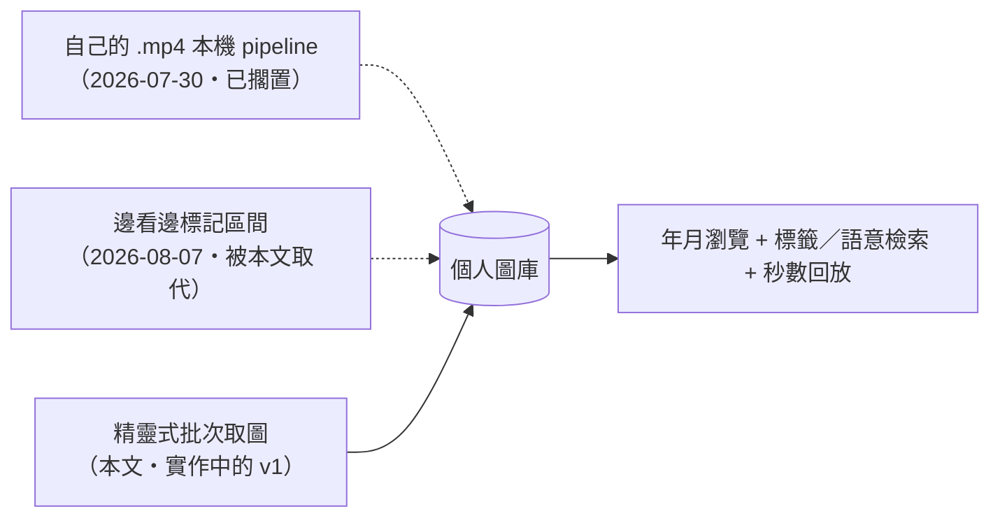
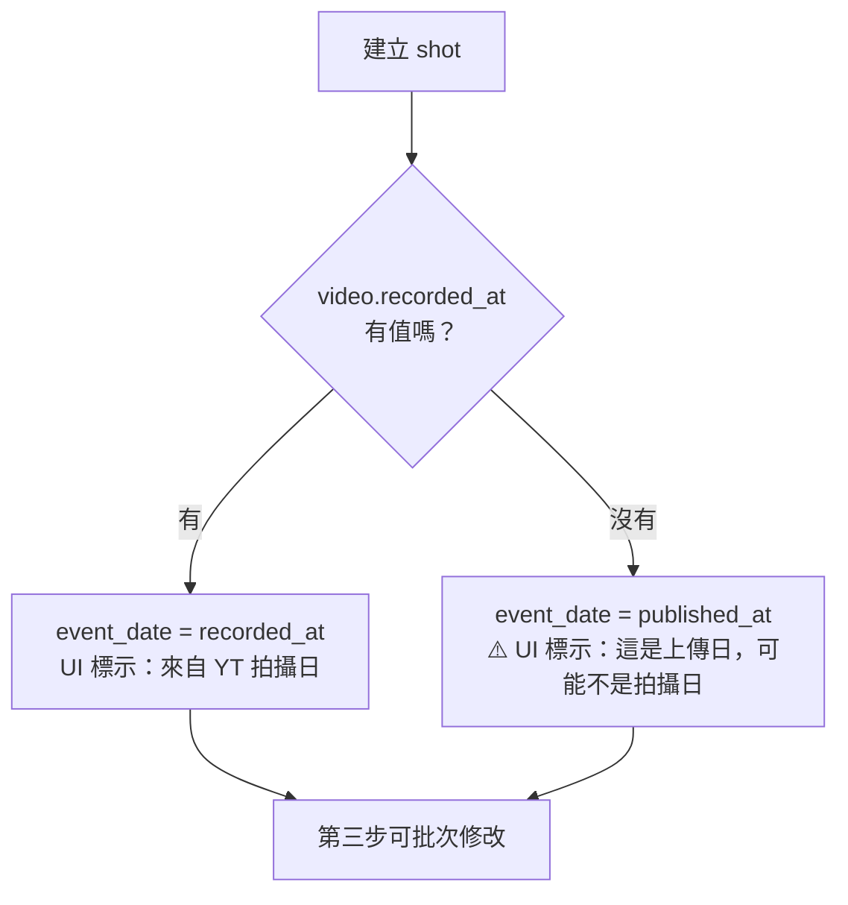
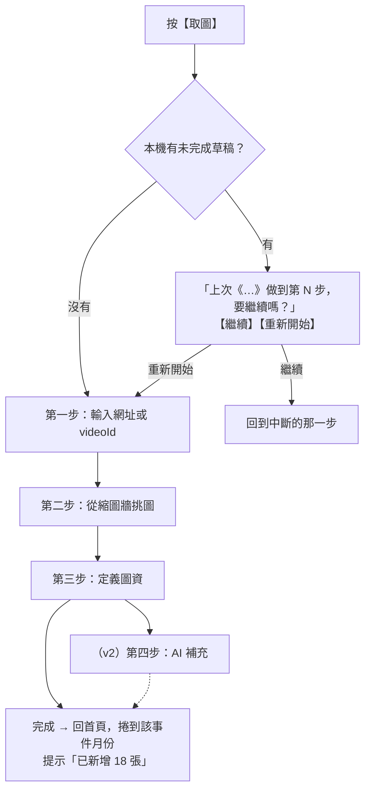
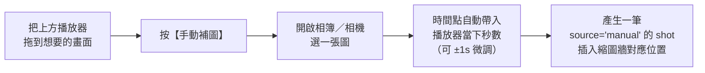
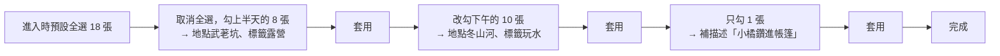
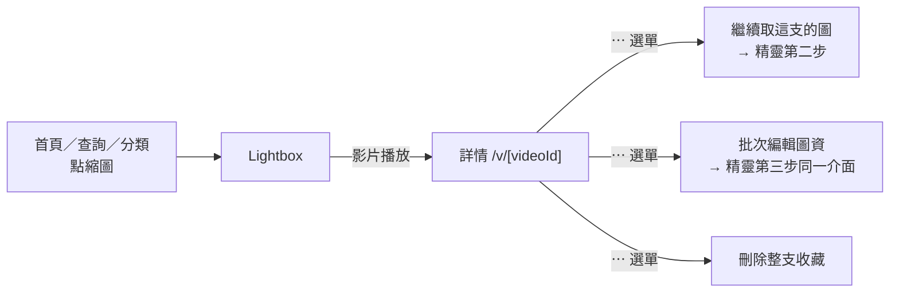

# yt-space Shot 設計規格書

> 從任何 YouTube 影片挑出畫面，成為可依時間瀏覽、依標籤與語意檢索的個人圖庫（手機優先）
> 建立日期：2026-08-27
> 狀態：第二輪複審修訂完成（待使用者確認）

---

## 〇、本文件的定位

本文件是 **yt-space 的新 v1**，取代 [`2026-08-07-yt-space-clip-design.md`](2026-08-07-yt-space-clip-design.md)。

改變的是**產品操作模型**，不是技術地基。舊規格第二節所有實測驗證過的技術事實原樣保留（見本文第二節），因為它們描述的是 YouTube 與 Cloudflare 的客觀行為，與 UI 怎麼設計無關。

| | 舊 spec（2026-08-07） | 本 spec（2026-08-27） |
|---|---|---|
| 擷取姿勢 | 邊看邊按【標記此刻】，一次一筆 | **步驟引導式精靈，一次批次挑一整批** |
| 資料單位 | `clip` = 區間 `[start_sec, end_sec]` | **`shot` = 單一時間點 `at_sec`** |
| 入口數量 | 三個（YT App 分享／截圖分享／播放器標記） | **一個**（導覽列中間的【取圖】） |
| AI 分析 | 建立後 3 分鐘自動送 Gemini | **v1 不做，列為第四步、v2 追加** |
| 待處理佇列 | `/inbox` 代辦頁 | **移除**（沒有 AI 就沒有待處理狀態） |
| 首頁 | 檢索框 | **年月縮圖牆**（immich 形式，已在 mockup 實現） |

三份規格的關係：



---

## 一、需求分析

### 1. 核心目標

把散落在 YouTube 上的影片畫面，收成**一個可以像相簿一樣瀏覽、像資料庫一樣檢索的個人圖庫**。不限於自己的影片，任何看得到的影片都能收。

### 2. 三個目標情境

**情境 A —— 依時間回顧**
打開首頁就是一面依年月分組的縮圖牆，往下滑就是往更早的時間走。想找「去年夏天」就選時間，牆面直接跳過去。

**情境 B —— 依標籤或語意找圖**
「加勒比海夜潛看到的大蝦」——用一句話描述，或點幾個標籤，把符合的畫面找出來。點縮圖就跳回原影片的精確秒數播放。

**情境 C —— 一次收一整支影片**
看到一支值得收藏的影片，一趟流程走完：貼網址 → 從整支影片的縮圖裡批次挑 → 統一給它們標籤與地點 → 完成。中間不需要來回切換頁面，也不需要等 AI。

### 3. 功能需求

- **批次取圖**：一支影片的所有可用畫面一次攤開，勾選即收藏。
- **降噪**：連續相似的畫面能一鍵過濾掉。
- **補洞**：YouTube 沒提供的畫面，能自己補圖並指定精確時間點。
- **低成本入庫**：填資料以批次為預設，描述允許留空。
- **年月瀏覽**：首頁即圖庫，依事件日期分組。
- **標籤與語意檢索**：兩種查詢法並存。
- **秒數級回放**：點縮圖跳回原影片的該秒。
- **手機優先**：主要操作場景是手機（Android）。

### 4. 產品定位

多租戶（multi-tenant）個人工具。每個使用者管理自己私人的圖庫，`owner_id` 從第一天就存在。v1 只服務作者本人，但認證機制天生支援多人（見第九節）。

---

## 二、已實測驗證的技術事實

> 以下均為實際發出請求驗證的結果，非推測。**這些是整份設計的地基，與 UI 改版無關，原樣自舊規格保留。**

### 1. Gemini 對 YouTube 影片的可及性（2026-08-07 實測）

| YouTube 隱私設定 | 匿名可及 | Gemini 可分析 | 驗證方式 |
|---|---|---|---|
| public | ✅ | ✅ | oEmbed HTTP 200 |
| unlisted（不公開） | ✅ | ✅ **實測通過** | `playabilityStatus: OK`；Gemini 正確回傳該區間描述 |
| private | ❌ | ❌ | — |

此事實在 v1 不直接使用（v1 不呼叫 Gemini），但決定了第四步 AI 的可行性。

### 2. YouTube Storyboard（縮圖來源）

YouTube 為進度條預覽功能，替每支影片預先產生 sprite 拼圖。**這是取得影片內真實畫面的唯一非下載途徑。**

實測 spec 字串（從 watch page HTML 的 `playerStoryboardSpecRenderer` 撈出）格式：

```
{baseURL}|{L0 spec}|{L1 spec}|{L2 spec}|{L3 spec}

每個 level spec：width#height#frameCount#cols#rows#intervalMs#nameReplacement#sigh
L3 範例：320#180#25#3#3#1000#M$M#rs$AOn4CL...
```

| 層級 | 單格尺寸 | 每張 sheet | 用途 |
|---|---|---|---|
| L2 | 160×90 | 5×5 = 25 格 | 本專案不採用（見第七節決策） |
| **L3** | **320×180** | **3×3 = 9 格** | **本專案主力** |

**關鍵特性：總格數固定、間隔隨片長縮放。** YouTube 固定總格數約 100～160 格，反推間隔，實測落在 1s / 2s / 5s / 10s 幾檔。

> **這條特性直接決定取圖精靈的體驗**：
> 一支 3 分鐘的影片每 2 秒一張，一支 30 分鐘的影片每 12 秒一張。
> **影片越長，可挑的畫面越粗** —— 這正是「手動補圖」要補的洞。
> 同時也代表**縮圖牆的張數與影片長度無關**，永遠是一兩百張，捲動成本可預期。

定位取「最近的一格」而非「之前的一格」（對照 YouTube 播放器 hover 預覽驗證），因此誤差為 **±間隔/2**。

### 3. 兩項關鍵限制（實測確認）

- `i.ytimg.com/sb/...`（storyboard 路徑）**不回傳任何 CORS header**。
- 回應 `cache-control: max-age=21600`，且 URL 含會過期的 `sigh` 簽名 → **必須轉存 R2**，不能直接引用原始 URL。
  - ⚠️ `max-age=21600`（6 小時）是 **CDN 快取存活時間，不是簽章有效期**，兩者無關。
    簽章實際多久失效**沒有對外承諾也量不出上限**：實測同一條 URL 在簽發 **70 小時後仍回 200**
    （竄改 `sigh` 或拿掉 `sqp` 則立即 403，確認簽章確實有在驗）。
    因此重抓排程**不可**依 6 小時設定；轉存 R2 的理由是「有效期不可知」，不是「6 小時到期」。

### 4. CORS 矩陣（2026-08-26 實測）

| 端點 | 瀏覽器可直接呼叫 | 實測 |
|---|---|---|
| `i.ytimg.com/vi/{id}/hqdefault.jpg` | ✅ | `access-control-allow-origin: *`、無簽章、不會過期 |
| `i.ytimg.com/sb/...`（storyboard sprite） | ⚠️ | **無任何 CORS header** |
| `youtube.com/watch` HTML | ❌ | 無任何 CORS header |
| `youtubei/v1/player`（InnerTube） | ❌ | preflight 直接 403 |
| `youtube.com/oembed` | ✅ | 有 CORS，但只給標題／作者／預設縮圖，**無 storyboard** |
| YouTube Data API v3 | ✅ | preflight 200 |
| Gemini `generativelanguage.googleapis.com` | ✅ | preflight 200 |

> **兩個容易誤解的點，本規格明確澄清：**
>
> 1. **sprite 無 CORS 不代表不能顯示。** CORS 只擋「讀取像素」（fetch / canvas）。
>    用 `` 或 CSS `background-image` 顯示完全可行 —— 因此**取圖精靈的縮圖牆可以直接引用
>    `i.ytimg.com` 顯示，不需經過任何代理**，開頁速度等同載入幾張圖片。
> 2. **但只要經過 Worker 代理，sheet 就變成同源，瀏覽器就能讀像素了。**
>    因此「裁切單格」與「相似度比對」**都在瀏覽器端進行**，Worker 只負責轉送位元組，
>    不引入任何影像處理相依（不用 WASM、不用 Cloudflare Images）。

### 5. 為什麼 iframe 截不到畫面

YouTube iframe 是跨來源內容，瀏覽器安全模型禁止讀取其像素。`canvas.drawImage()` 後呼叫 `toBlob()` 會拋出 `SecurityError`。**這條路完全沒有繞法。**

→ 直接決定「手動補圖」的形態：**圖只能由使用者自己提供**（手機截圖或相簿照片），系統無法從播放器抓圖。

### 6. YouTube 的拍攝日期

`videos.list` 的 `recordingDetails.recordingDate` 是**上傳者自行選填**的欄位，**多數影片為空**。
`snippet.publishedAt` 則是上傳日期，必定存在。

→ 直接決定 `shot.event_date` 的預設值策略（見第四節）。

---

## 三、整體架構

```
                      ┌──────── 手機（Android・PWA）────────┐
                      │  yt-space PWA                       │
                      │   ・首頁：年月縮圖牆                │
                      │   ・查詢：標籤／文字兩種查詢法       │
                      │   ・取圖：四步驟精靈 ★ 核心          │
                      │   ・詳情：播放 + 就地編輯            │
                      └──────────────┬──────────────────────┘
                                     │ 同源 HTTP
                                     │（Cloudflare Access 保護）
                      ┌──────────────▼──────────────────────┐
                      │  SvelteKit on Cloudflare Workers    │
                      │  ・+server.ts 即 API                │
                      │  ・D1：video / shot / tag + FTS5    │
                      │  ・R2：縮圖單格 webp + 手動補圖     │
                      └──────┬───────────────┬──────────────┘
                             │               │
                   ┌─────────▼───┐    ┌──────▼──────────────────┐
                   │ Gemini Flash│    │ YouTube                 │
                   │ ・查詢解析  │    │ ・Data API v3 metadata  │
                   │ ・(v2) 分析 │    │ ・watch page storyboard │
                   └─────────────┘    │ ・iframe 播放器          │
                                      └─────────────────────────┘
```

### 核心設計原則

1. **單一部署目標**：SvelteKit 的 `+server.ts` 就是 API。同源無 CORS，Cloudflare Access 一條規則保護全部。
2. **單一入庫路徑**：v1 只有取圖精靈一個入口。沒有第二條路徑，就沒有兩套需要同步的邏輯。
3. **不下載影片**：所有畫面來自 storyboard 或使用者自己提供。不碰 yt-dlp，不觸 ToS 灰色地帶。
4. **影像處理一律在瀏覽器**：Worker 只轉送位元組。裁切、縮圖、相似度比對都用瀏覽器原生的 canvas。
5. **資料層可抽換**：`repo` 介面後面掛 `mock`（原型）與 `d1`（正式），UI 完全不知道差別。
6. **多租戶就緒**：`owner_id` 來自 Cloudflare Access JWT 的 email，所有查詢以其隔離。
7. **功能降級，絕不當機**：storyboard 是非官方端點，必須假設它終將失效（見第七節）。

### 渲染模式：這是 SPA 嗎？

**這不是「前端一個專案、後端一個專案」的前後端分離**，也不是每頁整頁重載的傳統後端渲染 —— 是同一個 SvelteKit 專案同時產出頁面與 API 的一體式（full-stack）架構，模式為 **SSR ＋ 客戶端路由**：

- **第一次開頁**：Worker 做伺服器端渲染（SSR），首屏直接是完整 HTML，手機上首載最快。
- **之後的所有導覽**：走客戶端路由，不重新整理頁面 —— **體感上就是 SPA**。取圖精靈四步之間的切換全在前端，狀態不落地。

不採用純 SPA（`adapter-static` + `ssr=false`）的理由：API 與頁面同一個 Worker 出，SSR 幾乎是免費拿到的；而 PWA 的安裝與離線快取兩種模式都做得到。v3 自架版換 `adapter-node` 後此模式照常成立（見第十八節）。

### 專案結構（pnpm workspace + Turborepo）

**採用 Turborepo。** 誠實說：只有一個 app 時 monorepo 是殺雞用牛刀，但本專案實際有三個回本點 —— ① 金絲雀探測是獨立的 Cron Worker（見第七節），與主應用分開部署；② `storyboard` 解析與 Drizzle schema 需要被 web 與 probe 兩端共用；③ v3 自架版會是第三個 app（見第十八節），屆時直接共用 packages。

**app 命名**：主應用取 `web`、未來的後台取 `admin`（`apps/web`／`apps/admin`）。曾考慮 `web-public`／`web-admin`，不採用 —— `public` 在網站語境容易誤讀成「未登入可看的公開區」，而本站其實整站都要登入；`admin` 一詞本身已經把「另一個是使用者面」講清楚了，前綴反而是噪音。

```
yt-space/（pnpm workspace + Turborepo）
├── turbo.json
├── pnpm-workspace.yaml
├── apps/
│   ├── web/                              # 主應用：SvelteKit PWA + API（會員面；未來後台＝apps/admin）
│   │   ├── src/
│   │   │   ├── routes/
│   │   │   │   ├── +page.svelte              # 首頁：年月縮圖牆
│   │   │   │   ├── search/+page.svelte       # 查詢：標籤／文字
│   │   │   │   ├── capture/+page.svelte      # ★ 取圖精靈（四步驟）
│   │   │   │   ├── v/[videoId]/+page.svelte  # 詳情：播放 + 影片層級管理
│   │   │   │   ├── folders/+page.svelte      # 分類：資料夾樹
│   │   │   │   ├── folders/[id]/+page.svelte # 分類：資料夾內容
│   │   │   │   ├── account/+page.svelte      # 帳號（含原設定頁全部內容）
│   │   │   │   └── api/
│   │   │   │       ├── shots/+server.ts
│   │   │   │       ├── shots/[id]/+server.ts
│   │   │   │       ├── shots/batch/+server.ts     # 批次套用圖資
│   │   │   │       ├── folders/+server.ts          # 資料夾 CRUD 與加入／移出
│   │   │   │       ├── search/+server.ts
│   │   │   │       ├── facets/+server.ts          # 標籤＋地點輪播
│   │   │   │       ├── video/[videoId]/+server.ts # metadata + sb_spec；DELETE = 刪整支收藏
│   │   │   │       ├── sheet/+server.ts           # storyboard sheet 代理
│   │   │   │       └── thumbs/+server.ts          # 單格 webp 上傳至 R2
│   │   │   └── lib/
│   │   │       ├── server/
│   │   │       │   ├── repo/{types,mock,d1}.ts
│   │   │       │   ├── youtube.ts        # metadata 取得（storyboard 解析在 packages/storyboard）
│   │   │       │   ├── gemini.ts         # 查詢解析（v2 追加影片分析）
│   │   │       │   └── auth.ts           # Access JWT → owner_id
│   │   │       ├── capture/              # 精靈專用元件與狀態
│   │   │       │   ├── wizard.svelte.ts  # 四步驟狀態機 + 草稿存取
│   │   │       │   ├── ShotGrid.svelte   # 縮圖牆
│   │   │       │   ├── MetaDrawer.svelte # 第三步的圖資抽屜
│   │   │       │   └── similarity.ts     # 感知雜湊（瀏覽器端）
│   │   │       ├── Lightbox.svelte       # 全屏檢視器（見第六節）
│   │   │       └── components/           # Thumb / TagChip / Player …
│   │   ├── static/manifest.webmanifest
│   │   ├── tests/e2e/
│   │   └── wrangler.toml
│   └── probe/                            # 金絲雀探測 Cron Worker（見第七節）
│       ├── src/index.ts                  # 每日探測 + 孤兒縮圖清理
│       └── wrangler.toml                 # 綁同一個 D1 / R2
└── packages/
    ├── storyboard/                       # spec 解析／定位（web 與 probe 共用；即現在的 src/lib/storyboard.ts）
    └── schema/                           # Drizzle schema + migrations + 共用型別
```

---

## 四、資料模型（D1）

> **欄位命名規則：凡是由 AI 產生或輔助的欄位，一律加 `ai_` 前綴**，一眼可辨哪些內容未經人工輸入。

```
video ── 被取過圖的 YouTube 影片（不一定屬於使用者）
  ├─ id              YouTube Video ID，即網址裡的 11 碼（PK）
  ├─ owner_id        擁有者識別，值為登入者的 email；所有查詢以此隔離（見第九節）
  ├─ title           影片標題，取自 YT metadata，唯讀
  ├─ channel_title   上傳頻道名稱，取自 YT metadata，唯讀
  ├─ published_at    YT 上傳日期，必定有值
  ├─ recorded_at     YT 拍攝日期（recordingDetails.recordingDate）；上傳者選填，多為 null
  ├─ duration_sec    影片總長（秒），用於手動補圖的時間上限與 AI 區間裁切
  ├─ privacy         隱私狀態：'public'（公開）| 'unlisted'（不公開）| 'unknown'（判不出來）
  ├─ sb_spec         storyboard 解碼參數 JSON（哪個層級、幾格、間隔幾秒、簽章…）；
  │                  只在取圖／重裁縮圖時用到，不在瀏覽讀取路徑上；抓不到時為 null
  └─ added_at        第一次對這支影片取圖的時間（圖庫收錄時間，非 YT 的任何日期）

shot ── 使用者從影片挑出的單一畫面（本系統的第一級公民）
  ├─ id              流水號（PK）
  ├─ video_id        屬於哪支影片 → video.id
  ├─ owner_id        擁有者識別，同 video.owner_id
  ├─ at_sec          ★ 這張圖在影片的第幾秒（唯一的時間軸欄位；播放與 AI 區間都由它推導）
  ├─ frame_index     storyboard 的第幾格，用於去重（同格不重複收）；手動補圖為 null
  ├─ source          畫面來源：'storyboard'（YT 縮圖裁出）| 'manual'（使用者自己上傳）
  ├─ event_date      ★ 事件發生日期，首頁年月分組的依據；預設值鏈見下方，可改
  ├─ place           ★ 地點，獨立欄位（非標籤）；查詢頁與標籤混排在同一條輪播
  ├─ description     使用者手寫的描述；允許留空，是 FTS 全文檢索的主要素材
  ├─ thumb_key       R2 縮圖物件的 key，一律有值（storyboard 裁格或手動上傳皆同一形態）
  ├─ ai_transcript   （v2）AI 聽到的語音內容；v1 恆為 null
  ├─ ai_visual_desc  （v2）AI 看到的畫面描述；與 description 並存，不互相覆蓋；v1 恆為 null
  ├─ ai_raw          （v2）AI 原始輸出的 JSON 快照，唯讀，供「還原成 AI 原版」；v1 恆為 null
  └─ created_at      這張 shot 入庫的時間

tag ── 標籤與暱稱（人／動物／主題；地點已獨立成 shot.place，不在此）
  ├─ id              流水號（PK）
  ├─ owner_id        擁有者識別
  ├─ name            標籤顯示名，如 "小橘" / "露營" / "阿明"
  ├─ kind            分類：'person'（人）| 'pet'（動物）| 'topic'（主題）| 'other'（其他）；UI 顯示為「顯示圖示」
  └─ aliases         別名 JSON 陣列，如 ["我家的貓","橘貓"]；檢索時視同 name

shot_tag ── shot 與 tag 的多對多關聯
  ├─ shot_id         → shot.id
  ├─ tag_id          → tag.id
  └─ source          這條關聯誰建立的：'human'（v1 唯一值）；v2 加 'ai'（AI 推測、待人工確認）

folder ── 使用者自訂的分類資料夾（樹狀；「馬拉松」「露營」這種人工策展的集合）
  ├─ id              流水號（PK）
  ├─ owner_id        擁有者識別
  ├─ parent_id       上層資料夾 → folder.id；根層為 null；深度上限 5 層（見下方評估）
  ├─ name            資料夾名稱；同一層內不可重名，長度上限 50
  └─ created_at      建立時間

shot_folder ── shot 與 folder 的多對多關聯（一張圖可同時放進多個資料夾）
  ├─ shot_id         → shot.id
  ├─ folder_id       → folder.id
  ├─ added_at        加入時間；資料夾內預設排序＝新加入在前
  └─ PRIMARY KEY (shot_id, folder_id)

shot_fts ── FTS5 全文檢索虛擬表（tokenizer = trigram，中文友善）
  └─ 索引 description + place（v2 追加 ai_transcript + ai_visual_desc）

facet_month_agg ── 查詢頁輪播用的月份彙總，讓輪播讀取量與 shot 總數脫鉤（見第八節）
  ├─ owner_id        擁有者識別
  ├─ ym              事件月份 'YYYY-MM'（取自 shot.event_date）
  ├─ facet_type      彙總對象種類：'tag' | 'place'
  ├─ facet_key       tag 時為 tag_id、place 時為地點字串
  ├─ count           該月該 facet 的 shot 數；shot 增刪改時同步增減
  └─ PRIMARY KEY (owner_id, ym, facet_type, facet_key)

sb_probe ── storyboard 解析器健康紀錄（營運用，前端不讀；見第七節）
  ├─ id              流水號（PK）
  ├─ video_id        被探測的影片；金絲雀探測時為固定的 canary ID
  ├─ kind            'real'（真實取圖時順帶記錄）| 'canary'（排程探測）
  ├─ result          'ok' | 'no_storyboard'（影片本身沒有）| 'parse_failed'（解析器疑似失效）| 'fetch_failed'（網路問題）
  └─ probed_at       探測時間
```

### 相對舊 spec 的變動

| 動作 | 項目 | 理由 |
|---|---|---|
| **改名** | `clip` → `shot` | 資料單位從「區間」變成「單一畫面」，名稱必須跟著改。目前僅有 mock 假資料，改名成本極低。 |
| **移除** | `end_sec` | 不存結束時間。播放＝跳到 `at_sec` 開始播，不自動停。 |
| **移除** | `analysis_mode` | 只剩一種入庫形態。 |
| **移除** | `origin` | 只剩一個入口。 |
| **移除** | `status` | 沒有 AI 就沒有 `inbox`/`analyzing`/`failed` 狀態；存進去就是完成。 |
| **合併** | `note` + `summary` → `description` | 舊設計中 `note` 是人寫的、`summary` 是 AI 寫的。v1 沒有 AI，兩欄合一；v2 的 AI 產出寫進 `ai_visual_desc`，不覆蓋 `description`。 |
| **新增** | `at_sec` | 取代 `start_sec`。 |
| **新增** | `frame_index` | 去重的關鍵，見下。 |
| **新增** | `source` | 區分 storyboard 與手動補圖，影響縮圖尺寸與「換一格」是否可用。 |
| **新增** | `place` | 使用者指定為獨立欄位，不再是 `kind='place'` 的標籤。`tag.kind` 因此移除 `'place'` 選項。 |
| **保留但 v1 不寫入** | `ai_transcript` / `ai_visual_desc` / `ai_raw` | AI 輔助欄位，一律 `ai_` 前綴。第四步上線時直接填，不需要資料庫遷移。 |
| **新增表** | `folder` / `shot_folder` | 分類資料夾（見第六節）。與 tag 的分工：tag 是「這張圖是什麼」的描述性 metadata，folder 是「我要把它收在哪」的人工策展，兩者都保留。 |

### `event_date` 的預設值鏈

首頁完全按 `event_date` 的年月分組，這個值填錯整面牆就排錯位置，因此它是第三步最重要的欄位。



因為 `recordingDetails.recordingDate` 多數為空（見第二節第 6 點），**警示狀態才是常態**。第三步的時間欄位因此在視覺上比其他欄位更顯眼，且它本來就是批次欄位 —— 一支影片改一次就好。

### 去重

`shot` 對 `(owner_id, video_id, frame_index)` 建唯一索引（`frame_index` 為 null 的手動補圖不受限）。

同一支影片重複取圖時，已收藏的格子在縮圖牆上標示為「已收藏」且不可重複勾選。

### 索引

- `shot(owner_id, event_date, id)` —— 首頁時間軸與 keyset 分頁
- `shot(video_id)` —— 詳情頁取單片所有 shot
- `shot(owner_id, place)` —— 地點篩選
- `shot_tag(tag_id)` / `shot_tag(shot_id)` —— 多對多 join
- `facet_month_agg(owner_id, ym)` —— 查詢頁輪播
- `folder(owner_id, parent_id)` —— 資料夾樹展開
- `shot_folder(folder_id, added_at)` —— 資料夾內容 keyset 分頁
- `shot_folder(shot_id)` —— 「這張圖在哪些資料夾」與刪除連動

---

## 五、取圖精靈（核心）

### 入口

底部導覽列五格等寬：

```
首頁 ・ 查詢 ・ 【取圖】 ・ 分類 ・ 帳號
```

原「設定」整頁併入「帳號」（見第十節），空出的一格給「分類」資料夾（見第六節）。

【取圖】不凸出、不加大，**只用顏色與其他四格區分**。理由：這是圖庫類 App，導覽列常疊在縮圖牆上方，凸出的按鈕會遮擋內容；顏色已足以標示它是主要動作。

**v1 移除的舊入口**：`/inbox` 代辦頁、Web Share Target（YT App 分享與截圖分享）、詳情頁的【標記此刻】、3 分鐘延遲自動分析。理由見第〇節。

### 流程總覽



每一步頂部有四段式進度指示。返回上一步不會丟失該步的選擇。

### 第一步：輸入網址

接受 `youtu.be/xxx`、`youtube.com/watch?v=`、帶 `&t=` 的網址、`youtube.com/shorts/`、以及純 videoId。

按【確定】後，`GET /api/video/{videoId}` 取回 metadata（Data API v3，`part=snippet,contentDetails,recordingDetails`）與 storyboard spec。可能的結果：

| 情況 | 行為 |
|---|---|
| 正常 | 進第二步 |
| 解析不出 videoId | 就地顯示錯誤，不換頁 |
| 影片不存在或為 private | 「這支影片抓不到，可能是私人影片或已被刪除」 |
| **有影片但沒有 storyboard**（過短／直播中／剛上傳） | **仍然進第二步**，縮圖牆顯示空狀態，工具列只開放【手動補圖】 |
| **storyboard 解析失敗**（解析器可能失效） | 同上，另記一筆 `sb_probe(result='parse_failed')` 供健康偵測 |
| 這支之前取過圖 | 正常進入，頂部提示「這支已收藏 12 張」，已收藏的格子標示且不可勾 |

### 第二步：從縮圖牆挑圖

```
┌───────────────────────────┐
│ ←  宜蘭兩天一夜           │
│ ▬▬▬ ▬▬▬ ─── ───           │  ← 四段進度
├───────────────────────────┤
│                           │
│    YouTube iframe         │  ← sticky 釘在頂部
│                           │
├───────────────────────────┤
│ 全部選取│過濾相似│手動補圖│只看已選│  ← 橫向捲動
├───────────────────────────┤
│ ┌────┐ ┌────┐ ┌────┐      │
│ │    │ │ ✓  │ │    │      │  ← 每列 3 張
│ │00:00│ │00:10│ │00:20│    │     右下角小字＝影片時間
│ └────┘ └────┘ └────┘      │     紅框＝已選
│ ┌────┐ ┌────┐ ┌────┐      │     藍框＝播放器正停在這格
│ │ ▣  │ │ ✓  │ │    │      │     灰＋鎖＝先前已收藏
│ │00:30│ │00:40│ │00:50│    │
│ └────┘ └────┘ └────┘      │
│           ⋮                │
├───────────────────────────┤
│ 共 148 張 · 已選 18  下一步→│
└───────────────────────────┘
```

#### 畫質層級與排列：L3、每列 3 張

| 決策 | 選擇 | 理由 |
|---|---|---|
| 層級 | **L3（320×180/格）**；該影片沒有 L3 時**自動降到最高可用層級（L2 → L1）**，工具列旁提示「這支影片只有較低畫質的縮圖」 | 手機上每格顯示寬度約 96px，清晰度綽綽有餘。L2 只有 160×90，格子縮到約 58px 時難以辨識畫面內容，而「看得清楚才選得準」正是這一步的全部價值。降級邏輯 `pickLevel()` 已實作於 `packages/storyboard`（找不到偏好層級就退而求其次）。 |
| 每列張數 | **3 張** | 與 L3 的清晰度相稱。一屏約 9 張，148 張約需捲 4～5 屏。 |

> **曾評估並否決：L2、每列 5 張。**
> 一屏可看 20 張、只需捲 1.5～2 屏、sheet 下載數從約 17 張降到約 6 張（L2 每張含 25 格）、
> 整頁下載量從約 900 KB 降到約 250 KB。效能全面較優，但單格辨識度不足以支撐「挑圖」這個動作本身。
> **這只影響挑圖時的預覽；存入資料庫的縮圖一律另抓 L3，兩者無關。**

#### 縮圖牆的載入方式

直接用 CSS `background-image` + `background-position` 引用 `i.ytimg.com` 的 sheet，**不經過代理**。
依據第二節第 4 點：sprite 無 CORS 只擋讀取像素，不擋顯示。因此開頁成本等同載入約 17 張圖片，且瀏覽器原生就會依序載入、依序顯示。

定位公式（`packages/storyboard` 已實作，即現在的 `src/lib/storyboard.ts`）：

```
frameIndex  = round(t / (intervalMs / 1000))     ← 取最近的一格
perSheet    = cols * rows
sheetIndex  = floor(frameIndex / perSheet)
posInSheet  = frameIndex % perSheet
row = floor(posInSheet / cols),  col = posInSheet % cols
```

#### 互動：點＝勾選，長按＝跳去播放

| 手勢 | 行為 |
|---|---|
| **點一下** | 切換勾選。整格都是點擊區。 |
| **長按 0.5 秒** | 上方播放器跳到該時間點播放，該格顯示藍框。震動回饋 15ms。 |
| 已收藏的格子 | 點擊無效，長按仍可跳去播放。 |

**決策理由**：挑圖是主要動作，必須拿到最順的手勢，而且不需要瞄準。曾評估「點＝播放、右上角小圓圈＝勾選」，但在 96px 寬的格子上小圓圈只有約 20px，選 30 張要精準點 30 次，否決。

首次進入第二步時，在工具列下方顯示一次性提示：「點一下收藏・長按看看那一段」，點任意處消失，記在本機不再出現。

#### 工具列

**【全部選取】** —— 全選／全不選切換。已收藏的格子不納入。

**【過濾相似】** —— 從**已勾選**的縮圖中，找出畫面幾乎相同的，只留每組的第一張。

- 在**瀏覽器端**進行。sheet 經 `GET /api/sheet?u=…` 代理後變同源，canvas 即可讀取像素（見第二節第 4 點）。第二步本來就要為「存單格」下載這些 sheet，因此幾乎不增加額外成本。
- 演算法：每格縮到 9×8 灰階，算 **dHash**（相鄰像素比較，得 64-bit 指紋），漢明距離小於門檻視為相似。依時間順序掃描，每組保留最早的一張。
- **過濾強度分三檔：高／中／低**（預設中）。按鈕旁的小選單切換，切換後立即以新門檻對原始勾選重算（不是在已過濾的結果上疊加）。強度高＝門檻寬＝更容易判定相似、砍得更多。暫定漢明距離門檻：高 ≤ 10、中 ≤ 6、低 ≤ 3，待實測調校（見第十六節）。因為比對在瀏覽器端且指紋已算好，切換強度是毫秒級。
- 只比對已勾選的縮圖，不比對全部 148 張 —— 使用者已經表達過意圖的才需要降噪。
- **結果直接套用**：相似的立即取消勾選，該格變半透明並打叉，**仍留在原位不消失**。頂部出現一條提示：「已過濾掉 6 張相似的　[復原]」。
- 可單獨點回任何一張被過濾的，也可按【復原】整批退回。
- 若已勾選少於 2 張，按鈕停用。

> 曾評估「分組列出讓使用者逐組確認」，最保險但多一個畫面、多一輪操作；以及「勾選時即時提醒」，需頻繁比對，體驗零碎。兩者皆否決 —— 有【復原】的即時套用已足夠安全。

**【手動補圖】** —— 補上 YouTube 沒提供的畫面。



- **圖只能由使用者提供**：YouTube 播放器的畫面截不到（第二節第 5 點），無解。UI 文案必須說清楚這一點，避免使用者以為系統會自動截圖。
- 時間點取自 iframe API 的 `getCurrentTime()`，是**精確秒數**，不受 storyboard 取樣間隔限制。
- 上傳的圖在前端先用 canvas 縮到 **480×270 webp**（約 20 KB）再送出。手機截圖原檔為 1080×2400，直接上傳浪費頻寬與 R2 空間。
- 補出的 shot 預設為已勾選，並依 `at_sec` 插進縮圖牆的正確位置，帶一個「手動」小標記。

**【只看已選】** —— 篩選顯示，方便確認最終結果。

#### 進入第三步

按【下一步】時，對每一張勾選的 storyboard 縮圖：Worker 代理取得所在 sheet → 瀏覽器 canvas 裁出該格 → 編成 **WebP q75** → 上傳 R2，key = `{videoId}/L3/{frameIndex}.webp`。手動補圖已在上一步完成上傳。

同一 key 已存在則跳過上傳（天然去重，見第七節）。

### 第三步：定義圖資

```
┌───────────────────────────┐
│ ←  定義圖資      18 張·8 已完成│
│ ▬▬▬ ▬▬▬ ▬▬▬ ───           │
├───────────────────────────┤
│ 全選│全不選│反選│未填的     │
├───────────────────────────┤
│ ┌──┐┌──┐┌──┐┌──┐          │  ← 每列 4 張（圖較小，
│ │● ││● ││● ││● │          │     這一步不需要辨識細節）
│ └──┘└──┘└──┘└──┘          │     ● 綠點＝已套用過
│ ┌──┐┌──┐┌──┐┌──┐          │     ✓ 紅框＝目前勾選中
│ │✓ ││✓ ││✓ ││✓ │          │
│ └──┘└──┘└──┘└──┘          │
├═══════════════════════════┤  ← 抽屜
│ 套用到已選的 10 張          │
│ 時間 [2025-07-12] ⚠上傳日  │
│ 地點 [冬山河            ]  │
│ 標籤 (玩水)(阿明)(＋)      │
│ 描述 [                  ]  │
│ ┌───────────────────────┐ │
│ │    套用到這 10 張      │ │
│ └───────────────────────┘ │
├───────────────────────────┤
│           完成 →           │
└───────────────────────────┘
```

#### 唯一的規則：抽屜永遠在編輯「目前勾選的那些」

沒有「批次模式」與「單張模式」的切換，因為那是同一件事：

| 勾選數 | 抽屜標題 | 行為 |
|---|---|---|
| 18（預設全選） | 套用到已選的 18 張 | 一次填完共同欄位 |
| 10 | 套用到已選的 10 張 | 第二輪不同的資料 |
| 1 | 套用到已選的 1 張 · 01:10 | 欄位直接顯示它現有的值 —— 這就是「單張編輯」 |
| 0 | 抽屜收合 | — |

**典型流程**（使用者提出的實際用法）：



#### 套用語意：蓋掉，但沒動過的欄位不套用

| 情況 | 行為 |
|---|---|
| 你**修改過**的欄位 | **覆蓋**勾選中每一張的該欄位（標籤亦然：整組換成抽屜裡的那組） |
| 你**沒碰過**的欄位 | **完全不套用**，各張維持原值 |
| 勾選多張且該欄位原值不一致 | 顯示 `〈多個值〉` 佔位字樣（紫色斜體），不動它就不會變 |

**為什麼要有「沒動過就不套用」這條**：純粹的「全部蓋掉」在使用者自己的分批流程下會變成陷阱 —— 第 1 輪標了「露營」、第 2 輪標了「玩水」，之後全選 18 張只想補一個「宜蘭」標籤時，露營與玩水會被一起洗掉。加上這條之後，「蓋掉」的單純規則仍然成立，但不會誤傷。

#### 欄位

| 欄位 | 預設值 | 說明 |
|---|---|---|
| **時間**（`event_date`） | 見第四節的預設值鏈 | 來自上傳日時顯示 ⚠️ 提示。首頁分組依據，視覺上最顯眼。 |
| **地點**（`place`） | 空 | 獨立欄位。輸入時提示使用者既有的地點（`SELECT DISTINCT place`）。 |
| **標籤** | 空 | chip 形式。輸入時提示既有標籤與其 aliases。 |
| **描述**（`description`） | 空 | **允許留空**，佔位字樣寫「留空，之後 AI 補」。 |

**為什麼描述可以留空**：18 張圖若每張都要打一段字，就是打 18 段 —— 沒有人會做完，設計必須承認這件事。真正拿來檢索的是標籤與地點，而它們天生適合批次。描述是唯一逐張才有意義的欄位，因此把它設計成可選，等第四步的 AI 上線再補。

#### 快捷列

| 按鈕 | 行為 |
|---|---|
| 全選 / 全不選 / 反選 | 標準操作 |
| **未填的** | 一鍵勾選所有還沒套用過資料的（沒有綠點的）。收尾時用。 |

#### 完成

按【完成】時若仍有未套用資料的 shot，顯示「還有 3 張沒填資料，仍要完成嗎？」——**提醒但不阻擋**，因為描述本來就允許留空。

完成後：寫入資料庫 → 清除本機草稿 → 導回首頁 → 自動捲到該 `event_date` 的月份 → 頂部提示「已新增 18 張」。

### 第四步：AI 補充（v2）

v1 不實作，但第三步的【完成】按鈕在 v2 會變成【下一步】，資料表欄位已預留（`ai_transcript` / `ai_visual_desc` / `ai_raw`）。規劃見第十七節。

### 草稿：中途離開

移除代辦頁後，未完成的精靈沒有地方可以列出，因此改為**本機草稿**：

- 進度存在 `localStorage`（**不上傳伺服器**），只記**最近一支**。
- 內容：`videoId`、目前步驟、已勾選的 `frame_index` 陣列、第三步已套用的圖資、手動補圖的 R2 key。
- 下次按【取圖】時詢問：「上次《宜蘭兩天一夜》做到第三步，要繼續嗎？　【繼續】【重新開始】」
- 完成或選擇【重新開始】後清除。
- 手動補圖已上傳 R2 的孤兒物件，由每日 Cron 清理超過 7 天未被任何 shot 引用者。

> 曾評估「按下一步時就先入庫、標記為未完成」，好處是換手機也能接著做，但那等於把剛移除的代辦頁請回來（首頁或某處必須顯示這些未完成的圖）。否決。

---

## 六、首頁、查詢、詳情

> 首頁與查詢頁的版面已在 `mockups/uiux/` 實現並驗收過，本節只記錄**相對於 mockup 的變動**。

### 首頁 `/`

版面完全不變：依 `event_date` 年月分組的縮圖牆、每月的標籤列、頂部「某月以前」的時間選擇器、immich 式懸浮時間軸。

兩處內部變動：

1. 資料來源 `clip` → `shot`，排序依 `event_date` 由新到舊。
2. **縮圖改讀 R2 的單格 webp**（``），不再用 CSS `background-position` 從 YouTube 的 sheet 上定位。理由見第七節。

### 查詢 `/search`

標籤查詢與文字查詢兩種方式保留。唯一變動是**地點的入口**：

地點是獨立欄位，不會自動出現在標籤輪播裡。作法是**把地點與標籤混在同一排輪播顯示，以不同顏色與圖示區分**：

```
[📍宜蘭 12] [📍冬山河 10] [⌗露營 8] [👤阿明 6] [🐈小橘 3] …
```

使用者不需要知道「宜蘭」是欄位而「露營」是標籤 —— 選了就查。實作上輪播資料來自 `GET /api/facets`，一次回傳兩種 facet，前端合併後依 count 排序。查詢時地點條件走 `shot.place = ?`，標籤條件走 `shot_tag`。

### 點縮圖的行為：全屏檢視器（Lightbox）

首頁與查詢結果的縮圖，點一下**不再直接跳詳情頁**，改為開啟全屏檢視器：

```
┌───────────────────────────┐
│ ✕                      ⋯  │
│                           │
│      ◀  [大圖]  ▶         │  ← 仍是 L3 320×180 原圖放大
│                           │     左右滑動 = 上一張／下一張
│                           │     （範圍 = 目前所在的清單）
├───────────────────────────┤
│ 小橘鑽進帳篷               │  ← 描述
│ 📍宜蘭 ⌗露營 ⌗搭帳篷      │  ← 地點與標籤
│ 2025-07-12 ·《宜蘭兩天一夜》│  ← 日期與影片
├───────────────────────────┤
│ [▶影片播放] [🗂加入分類]   │
│ [分享] [✎編輯]  [🗑刪除]  │
└───────────────────────────┘
```

| 元素 | 行為 |
|---|---|
| 大圖 | R2 的單格 webp 放大置中（`object-fit: contain`）。全屏放大約 3 倍會偏軟，這是儲存 320×180 的天生限制，可接受。 |
| 左右滑動 | 上一張／下一張。範圍是**目前所在的清單**：從首頁進來＝該月份分組，從查詢結果進來＝該次結果。 |
| **【▶ 影片播放】** | 導向 `/v/{videoId}?t={at_sec}`，詳情頁播放器從該秒開始播。（曾命名「跳到影片時間」，太長，定案「影片播放」。） |
| **【分享】** | 以 **Web Share API**（`navigator.share`）叫出系統分享面板，內容為 `https://youtu.be/{videoId}?t={at_sec}`；不支援的環境退回「複製連結」＋ toast 提示。分享的是 YouTube 原片連結（帶秒數），任何人都能開。 |
| **【🗂 加入分類】** | bottom sheet 列出資料夾樹（可勾多個），勾選即加入／移出，關閉即生效。可在此直接【＋新增資料夾】。 |
| **【✎ 編輯】** | bottom sheet 就地編輯描述／標籤／地點／時間，與詳情頁的就地編輯同一個元件。 |
| **【🗑 刪除】** | 確認後刪除這張 shot，檢視器自動滑到下一張。 |

> 決策記錄：先前版本是「點縮圖 → 詳情頁跳秒播放」。改為 lightbox 的理由 —— 這是圖庫，
> 使用者點縮圖的第一意圖是「看這張圖」，不是「看影片」；相簿式的全屏＋左右滑是手機上
> 最熟悉的模式，「跳去影片」降為明確的第二步動作。分享採 Web Share API 而非單純複製，
> 因為在手機上「分享到某個 App」才是真實動線，複製只是它的降級。

### 分類 `/folders`（新增）

**情境**：首頁滑到喜歡的圖，不想每次都滑很久才找到 —— 把它收進自己命名的資料夾。例如今年 1、3、6 月各跑了一場馬拉松，建一個「馬拉松」資料夾把那些縮圖放進去，之後一點就到。

**與標籤的分工**：tag 描述「這張圖是什麼」（AI 與檢索用的 metadata），folder 是「我要把它收在哪」（純人工策展）。跑馬拉松的圖可能標籤各不相同，但都收在同一個資料夾 —— 兩者不互相取代。

```
分類                    ［＋新增］
┌───────────────────────────┐
│ 🗂 馬拉松            34 › │
│ 🗂 旅遊              120 ›│
│    🗂 2025 沖繩       56 ›│   ← 子資料夾縮排
│    🗂 2024 九州       64 ›│
│ 🗂 小橘精選           18 ›│
└───────────────────────────┘
```

| 規則 | 內容 |
|---|---|
| 結構 | 樹狀，**深度上限 5 層**；同層不可重名 |
| 一張圖可進幾個資料夾 | 不限（多對多） |
| 資料夾頁顯示 | 上半：子資料夾清單；下半：本層的圖（依 `added_at` 新到舊，keyset 分頁）。計數顯示**含子孫層**的總數 |
| 點圖 | 開 Lightbox，左右滑動範圍＝該資料夾本層的圖 |
| 加入圖片 | 由 Lightbox 的【加入分類】進行（首頁／查詢／分類任一處看到圖都能收）；資料夾頁不提供「挑圖加入」，避免再造一個挑圖介面 |
| 管理 | 新增（選父層）、改名、刪除。刪除資料夾＝**連同子資料夾與所有關聯一併刪，圖本身不動**，確認框明示範圍。搬移資料夾（換父層）列 v2 |
| shot 被刪時 | `shot_folder` 關聯一併清除（含刪整支收藏） |

**大量資料下的壓力評估**：壓力不在樹，在圖。`folder` 表每人頂多數百列，遞迴 CTE 展開整棵樹是毫秒級；資料夾內容走 `shot_folder(folder_id, added_at)` 索引 keyset 分頁，與首頁同一套原則（不掃全量）。**含子孫的計數**是唯一要小心的點：對小樹（數百節點）用一條遞迴 CTE ＋ join 聚合即可，不需要彙總表 —— 這是「深度限 5 層、同層不設數量上限」仍然安全的原因；若未來實測變慢，再比照 `facet_month_agg` 加彙總表，資料模型不動。

### 詳情 `/v/[videoId]`

變動最多的一頁：

| 動作 | 項目 |
|---|---|
| **移除** | 底部的【標記此刻】FAB（v1 沒有這個入口） |
| **改變** | 播放器改用真的 YouTube iframe，點縮圖跳到 `at_sec` 開始播、不自動停 |
| **改變** | 「我的標記」改名為「這支影片的收藏」 |
| **新增** | **點任一張可就地編輯圖資**（描述／標籤／地點／時間），bottom sheet 由下滑出，播放器留在上方繼續播 |
| **新增** | **【繼續取這支的圖】** —— 直接跳進精靈第二步，已收藏的格子標示出來 |
| **新增** | 刪除單張 shot |
| **新增** | 影片層級的批次編輯與刪除（見下） |

「就地編輯」是必要的：取圖是批次動作，事後一定會想修某一張，不能只有精靈裡改得到。

### 影片層級的管理（與取圖功能呼應）

取圖精靈負責「收進來」，詳情頁負責「收進來之後的一切」。詳情頁右上角 `⋯` 選單提供三個影片層級動作：



**【批次編輯圖資】** —— 把這支影片的**所有已收藏 shot** 載入**精靈第三步的同一個介面**（網格＋勾選＋抽屜＋套用語意完全相同），改完按【完成】回詳情頁。這就是「事後想幫整批補標籤／改地點」的答案 —— 不另做一套批次編輯 UI，直接複用第三步。

**【刪除整支收藏】** —— 確認對話框明示範圍：「將刪除這支影片的 12 張收藏（含 2 張手動補圖），YouTube 原片不受影響。」確認後：

1. 刪除該影片的所有 `shot` 與 `shot_tag`
2. 同步遞減 `facet_month_agg`
3. 刪除 R2 上該影片的所有縮圖物件（`{videoId}/` 前綴一次列舉刪除）
4. 刪除 `video` 那一列
5. 導回首頁，toast「已刪除《宜蘭兩天一夜》的 12 張收藏」

單張 shot 的刪除（lightbox 或詳情頁）做同樣的 1–3 步但只針對那一張；該影片最後一張被刪掉時，順帶清掉 `video` 列。**所有刪除都是硬刪除，不做回收桶** —— 資料可從 YouTube 重新取圖恢復，成本低，不值得為它養一套軟刪除狀態。

---

## 七、縮圖策略

> **命名注意**：本節的 `L0`~`L3` 是 **YouTube 定義的 storyboard 畫質層級**，是外部規格，改不了。

### 主力：storyboard L3 單格，裁成獨立 WebP 存 R2

| 決策 | 選擇 | 一句話理由 |
|---|---|---|
| 畫質層級 | **L3（320×180/格）** | 與 YouTube 播放器 hover 預覽同一層 |
| 存放形態 | **裁成單張 WebP，一格一個 R2 物件** | 存整張 sheet 在儲存與頻寬上都沒有優勢，見下 |

#### 為什麼不存整張 sheet

實測 9 支影片，L3 單格重新編成 WebP q75，平均是 sheet 內每格的 **0.96 倍** —— 比原本還小。重編碼的世代損失讓檔案變大，但 WebP 比 YouTube 用的 JPEG 有效率，兩者剛好抵銷還有找。

| | 整張 L3 sheet | 單格 WebP q75 |
|---|---|---|
| 實測平均 | 54.0 KB / 9 格 | 5.9 KB / 格 |
| 換算門檻 | 一張 sheet 要收藏到 **9.2 格**才划算 | —— 但一張只有 9 格 |

**門檻高於容量上限，代表存 sheet 永遠不會比較省。**

#### 對讀取路徑的影響（真正的決定因素）

首頁時間軸與查詢結果**都是跨影片、依時間排序**，一屏 20 張縮圖來自 20 個不同時段：

| | 一屏 20 張要傳輸 |
|---|---|
| 存 sheet | 20 × 54 KB ≈ **1.1 MB** |
| 存單張 | 20 × 5.9 KB ≈ **118 KB** |

差 9 倍，且這是手機 PWA，每次往下捲都付一次。單張另外換到三件事：原生 ``、跳轉冷區時的首次繪製、以及**與手動補圖統一的資料模型**（`shot.thumb_key` → 一個 R2 物件，不管來源是什麼）。

> **注意這與第五節不衝突**：取圖精靈的縮圖牆是**同一支影片的連續格子**，locality 極高（一張 sheet 就是 9 個相鄰時間點），所以那裡直接用 sheet 顯示最快。而首頁與查詢是**跨影片的稀疏取用**，locality 幾乎不存在，所以存單格最省。兩處的選擇不同，是因為取用模式不同。

### 流程

```
第二步按【下一步】時，對每一張勾選的 storyboard 縮圖：
1. 前端已有 sb_spec（第一步取得），以 pickLevel() 取最高可用層級（L3 → L2 → L1），
   算出 frameIndex 與 sheetIndex
2. 若 R2 已有 {videoId}/L{level}/{frameIndex}.webp → 跳過
3. 透過 GET /api/sheet?u={sheetUrl} 代理取得該張 sheet
4. canvas 裁出該格，toBlob('image/webp', 0.75)
5. PUT /api/thumbs → R2，key = {videoId}/L{level}/{frameIndex}.webp
6. sheet 本身不留存；解碼參數存進 video.sb_spec（供日後重裁）
7. 讀取時 ，不需要 sb_spec
```

**裁切在瀏覽器做，不在 Worker 做。** 瀏覽器原生就有 WebP 編碼器（`canvas.toBlob`），Worker 只負責轉送位元組，**不引入任何影像處理相依**。

⚠️ 代理是必要的：`i.ytimg.com` 不回傳 CORS header，直接載入會讓 canvas 被 taint，`toBlob()` 會拋 `SecurityError`。Worker 代理讓 sheet 變成同源。

⚠️ 代價：裁切依賴前端，**必須在開著的分頁裡完成**。第三步進場時顯示「處理縮圖 12/18」進度，通常在一兩秒內跑完。

`key` 用 `{videoId}/L{level}/{frameIndex}` 而非 shot id，**同一支影片被不同批次取到同一格時天然去重**。同一支影片只會用一個層級（該影片的最高可用層級），不會混用。

### ⚠️ 這是非官方端點

storyboard 端點**沒有任何官方文件或相容性承諾**。YouTube 前端每隔數月改版，`playerStoryboardSpecRenderer` 的欄位名稱、位置、格式都可能變動。

**因此設計上必須假設它終將失效：**

- 抓不到 spec → 第一步仍可進第二步，縮圖牆空白，只開放【手動補圖】
- UI 明白提示「無法取得這支影片的逐段縮圖，可以手動補圖」
- **功能降級，絕不當機**
- **已存入 R2 的單格縮圖完全不受影響**，首頁與查詢照常運作；失效只影響「之後新加入的影片」

### 健康偵測與告警（營運面）

> **定位聲明**：這整段是**營運管理功能，不屬於前端產品**。目前沒有後台管理介面的規劃，
> 也**不對前端做任何告警通知** —— 解析器失效時，使用者操作取圖自然會看到
> 「無法取得逐段縮圖，可手動補圖」的功能性訊息，那就是前端唯一需要的表達。
> 本段的目的只有一個：**讓管理員（作者本人）不必等到自己撞上，就知道解析器壞了。**

#### 0. 部署形態：獨立的 probe 子專案

金絲雀探測獨立成 Turborepo 的 `apps/probe` —— 一個只有 Cron Trigger 的小 Worker，
與主應用分開部署，綁同一個 D1 與 R2：

- 主應用的部署與 probe 互不牽動；改探測邏輯不用重佈主站
- `packages/storyboard` 的解析程式碼由兩端共用 —— **probe 測的就是主站實際在跑的那份程式碼**
- probe 順帶承擔每日的孤兒縮圖清理（見第五節草稿一節）

#### 1. 區分三種失敗（避免誤報）

| `result` | 判斷條件 | 意義 | 是否告警 |
|---|---|---|---|
| `ok` | 成功解析出 spec | 正常 | — |
| `no_storyboard` | watch page 正常，但**該影片確實沒有** storyboard | 影片本身的特性 | ❌ 靜默降級 |
| `parse_failed` | watch page 正常，但**連預期的頁面結構都找不到** | ⚠️ **解析器可能失效** | ✅ 納入判定 |
| `fetch_failed` | watch page 根本取不到 | 環境問題 | ❌ 不計入 |

判定 `no_storyboard` 與 `parse_failed` 的差異，靠檢查頁面上**其他必定存在的錨點**（`playabilityStatus`、`lengthSeconds`）：這些都在、只有 storyboard 那段不在 → `no_storyboard`；連錨點都消失 → `parse_failed`。

#### 2. 金絲雀探測

`apps/probe` 以 **Cloudflare Cron Triggers**（免費層支援）每日對一支**已知必定有 storyboard 的公開影片**執行探測，結果寫入 `sb_probe`。金絲雀失敗 → 100% 是解析器失效，與個別影片無關。這讓判定幾乎不可能誤報。

#### 3. 告警管道（依成本與可行性評估）

觸發條件：金絲雀**連續失敗 2 次**（單次失敗只記錄，可能是暫時性網路問題）；或真實取圖近 10 次有 ≥ 8 次 `parse_failed`（提早發現）。

觸發後依序做三件事：

| 順位 | 管道 | 評估 |
|---|---|---|
| 1 | **寫入 D1**（`sb_probe` 本身就是紀錄） | ✅ v1 必做。零成本，事後可查完整歷史。管理員以 `wrangler d1 execute` 或 Cloudflare Dashboard 查詢。 |
| 2 | **Workers Logs（observability）結構化紀錄** | ✅ v1 必做。probe 以 `console.error(JSON.stringify({alert:'sb_parser_down', …}))` 輸出，在 Dashboard 的 Workers Logs 介面可直接篩選；免費層含 200k events/日，綽綽有餘。 |
| 3 | **Cloudflare 發信通知管理員** | ✅ **採用**。Workers 的 `send_email` binding 可免費發信，前提是自訂網域＋啟用 Email Routing —— **`scottchayaa.com` 已在 Cloudflare 上，前提成立**。probe 加一個 binding，觸發時寄一封摘要（連續失敗次數、最近的 `sb_probe` 紀錄）到管理員信箱。每日 Cron 只跑一次，量極小，遠低於免費額度。 |

不做的：前端橫幅（前端不需要知道營運狀態）、第三方 webhook（不為此引入外部服務）、推播。

#### 4. 恢復

金絲雀探測成功即視為恢復（`sb_probe` 最新一筆 `ok`）。降級期間加入的影片，可在帳號頁按【重新抓取缺少的縮圖】批次補抓 —— 這一顆是**使用者面的修復功能**，與營運告警無關，因此留在帳號頁（見第十節）。

### 資產尺寸與快取

| 資產 | 尺寸 | 快取 |
|---|---|---|
| storyboard 單格 | L3 320×180（降級時 L2 160×90），WebP q75，**約 5.9 KB/格** | key = `{videoId}/L{level}/{frameIndex}.webp`，`Cache-Control: public, max-age=31536000, immutable` |
| 手動補圖 | 480×270 webp，約 20 KB | key = `{videoId}/manual/{uuid}.webp`，同上 |

500 張 shot 的總資產量約 3 MB，遠低於 R2 免費額度 10 GB。

---

## 八、檢索與播放

### 標籤查詢

前端從 `GET /api/facets?upTo={ym}` 取得該時間範圍內的標籤與地點及其計數，使用者多選後送查詢。純 SQL，不經 AI。

### 文字查詢

以「加勒比海夜潛看到的大蝦」為例：

```
1. 查詢解析（Gemini Flash 一次輕量文字請求；失敗時退回規則式關鍵字切分）
   → { date_from: null, date_to: null,
       places: ["加勒比海"], tags: ["夜潛"], keywords: ["大蝦"] }

2. facet 對應：以 name 與 aliases 在 D1 比對出 tag_id；place 直接字串比對

3. SQL 檢索（全在 D1，毫秒級）：
   SELECT ... FROM shot s
   LEFT JOIN shot_tag st ON st.shot_id = s.id
   WHERE s.owner_id = ?
     AND (s.event_date <= ? OR ? IS NULL)
     AND (s.place = ? OR st.tag_id IN (?) OR
          s.id IN (SELECT rowid FROM shot_fts WHERE shot_fts MATCH ?))
   ORDER BY <相關度>

4. 回傳 [{ video_id, at_sec, description, place, event_date,
           channel_title, thumb_key, score }, ...]
```

**FTS5 使用 `trigram` tokenizer**：預設的 `unicode61` 對中文是逐字切分，檢索品質差；trigram 的 3-gram 匹配對中文明顯較佳。

### 相關度排序

`place` 命中 > `tag` 命中 > FTS 命中。避免「描述裡剛好講到宜蘭兩個字」壓過「這張圖的地點就是宜蘭」。日期越接近查詢區間中心者微幅加分。

### 顯示查詢解析結果

文字查詢的結果列上方常駐一行「**聽懂了：加勒比海・夜潛・大蝦　[修改]**」。這讓使用者在搜不到東西時，能立即分辨是「解析錯誤」還是「圖庫裡確實沒有」。

### 播放

點縮圖 → **Lightbox**（見第六節）→【影片播放】→ 詳情頁 iframe 跳到 `at_sec` 開始播放：

```
https://www.youtube.com/embed/{id}?start={at_sec}&autoplay=1&playsinline=1
```

**不設 `end` 參數** —— 沒有結束時間了，跳過去就繼續往下播，想停自己停。這比舊設計的「播 30 秒就停」更符合「我想看看這附近發生什麼事」的實際需求。

### 規模化

**畫面上任何動作都不掃全量，只碰「一頁」或「一張彙總」**：

1. **結果 keyset 分頁** —— 一次 50 筆，游標為「上一頁最後一筆的 `(event_date, id)`」，`WHERE (event_date, id) < (?, ?) ORDER BY event_date DESC LIMIT 50`，走 `shot(owner_id, event_date, id)` 索引。避免 `OFFSET`。
2. **輪播讀 `facet_month_agg`** —— 在 shot 建立／刪除／改 `event_date`／改標籤／改地點時增減計數。任意時間範圍的輪播 = 對區間內月份做 `SUM(count) GROUP BY facet_key`，讀取量與 shot 總數脫鉤。
3. **輪播 top-N** —— 依 `SUM(count)` 取前 30，其餘「顯示更多」展開。

有這三項後，開頁、拉時間軸、選標籤都只碰一頁結果或一張彙總，故日期範圍無上限。

### 多租戶下的規模天花板

查詢隔離沒問題（每條查詢與索引皆以 `owner_id` 起頭）。真正的天花板是**容量與計費**，非查詢速度：D1 單庫約 10GB 上限，逼近時依 `owner_id` 分片（資料模型不變）；讀多可加 D1 read replication（免費）。皆屬營運階段決策，非 v1 阻塞項。

---

## 九、認證與多租戶

### 這一段在做什麼

「用 Google 帳號登入」其實是兩件事的合稱：**①讓使用者證明自己是誰**（跳 Google 登入頁、拿回身分），**②讓伺服器擋掉沒登入的請求**（每一條 API 都要驗證來者何人）。多數方案要為 ② 寫驗證程式碼；本專案選的 Cloudflare Access 把 ①② 都搬到 Cloudflare 的邊緣網路做掉。

**Cloudflare Access（Zero Trust）＋ Google 作為 IdP** 的運作方式：

1. 在 Cloudflare 後台對整個站點掛一條規則：「只有名單上的 Google 帳號能進」
2. 訪客第一次開站，Cloudflare **在請求碰到我們的 Worker 之前**先把人導去 Google 登入
3. 登入通過後，之後每個請求都自動帶 `Cf-Access-Jwt-Assertion` header
4. 我們的程式只做一件事：從該 header 取出 email 當 `owner_id`（`apps/web/src/lib/server/auth.ts`，約十行）

選它的理由：**應用程式端幾乎零行認證程式碼**；沒登入的人連靜態資源都拿不到（攔截發生在邊緣，不消耗 Worker 額度）；免費層 50 人。站點掛在自有網域 `shots.scottchayaa.com`（見第十三節），Access policy 直接綁該 hostname。

### 與「純前端 Google 登入」的差異

「純前端 Google 登入」指在頁面裡嵌 Google Identity Services（GIS），使用者點按鈕登入、前端拿到 ID token。差異的關鍵在 **②伺服器驗證**：

| | Cloudflare Access | 純前端 GIS 登入（不做後端驗證） | GIS ＋ 後端驗證 token |
|---|---|---|---|
| 前端登入體驗 | 整站攔截，Cloudflare 的登入頁 | 站內按鈕，體驗較原生 | 站內按鈕 |
| **API 是否受保護** | ✅ 到不了 Worker | ❌ **完全沒有** —— 任何人打開 devtools 直接 `fetch('/api/shots')` 就能讀寫資料庫，登入按鈕只是裝飾 | ✅ 每條 API 驗一次 |
| 應用程式端程式碼 | ~10 行（讀 header） | 0 行（但等於不設防） | 中等（驗 JWT 簽章、快取 Google 公鑰、處理過期） |
| 綁定 Cloudflare | ✅ 是 | 否 | 否 |

結論：「不經過後端」的純前端登入對**存有伺服器資料**的系統不成立 —— 資料在 D1/R2，防線必須在伺服器側，否則形同裸奔。真正的比較是 Access vs「GIS＋後端驗證」，兩者都安全；v1 選 Access 是因為程式碼最少、且攔截在邊緣。**代價是綁 Cloudflare** —— v3 自架版沒有 Access 可用，屆時換成「GIS＋後端驗證」，`owner_id` 一樣是 email，資料層完全不用動（見第十八節）。

所有 repo 方法一律要求 `owner_id` 參數，這條規則與認證方案無關，永遠成立。

---

## 十、帳號頁（原設定頁併入）

獨立的「設定」頁取消，全部內容併入導覽列最右的「帳號」頁 `/account` —— 設定項目已經少到撐不起一頁，而帳號頁本來就要存在。

| 區塊 | 項目 | 變動 |
|---|---|---|
| 帳號 | Google 頭像、名稱、email、登出 | 不變 |
| **AI 分析區間** | 往前 `10` 秒 / 往後 `20` 秒（兩個獨立數字） | **新增**。v1 顯示但不生效，標示「第四步上線後生效」 |
| 標籤管理 | 合併、改名、編輯 aliases | 不變 |
| 縮圖服務 | 【重新抓取缺少的縮圖】（解析器降級期間入庫的影片，恢復後批次補抓） | **縮減**：健康狀態顯示與【立即重新探測】移除 —— 金絲雀屬營運面（見第七節），前端不呈現 |

**移除**（對應功能已不存在）：標記前秒數、標記後秒數、標記時自動暫停、代辦自動處理延遲、Gemini 每日配額用量。

「AI 分析區間」是兩個**獨立**的數字而非對稱區間，因為「有趣的事剛剛發生」與「有趣的事正要發生」需要不同的取樣偏好。存 shot 時不計算，只在第四步送 Gemini 時才由 `at_sec` 推導出 `[at_sec - N, at_sec + M]`。

---

## 十一、實作順序

資料層從第一天就切乾淨：`repo/{types,mock,d1}.ts`，以環境變數 `DATA_SOURCE=mock|d1` 切換。**原型階段所有畫面、路由、播放器、手勢都是真實的，僅資料為假。原型即產品，不會丟棄。**

| 階段 | 內容 | 完成時看得到什麼 |
|---|---|---|
| 1 | Turborepo 骨架（apps/web + packages/storyboard・schema）、`clip` → `shot` 改名、repo 介面調整、首頁／查詢／詳情改接新模型（假資料） | 現有三頁在 monorepo 與新資料模型上照常運作 |
| 2 | 精靈第一、二步：輸入網址、縮圖牆（含 L2 降級）、點選、全部選取、只看已選 | 能貼網址、看到整支影片的縮圖、勾選 |
| 3 | 伺服器端縮圖：`/api/video`、`/api/sheet` 代理、前端裁切、`/api/thumbs` 存 R2 | 勾選的圖真的存下來了 |
| 4 | 過濾相似（瀏覽器端 dHash、強度三檔） | 一鍵降噪 |
| 5 | 手動補圖（相簿選圖、縮圖、上傳、時間點帶入） | 補得了 YouTube 沒給的畫面 |
| 6 | 精靈第三步：勾選子集、抽屜、套用語意、快捷列 | 一趟流程能走完並入庫 |
| 7 | 草稿續做、完成後導回首頁並捲到該月份 | 中斷不再白費 |
| 8 | Lightbox：全屏檢視、左右滑動、影片播放、加入分類、分享、編輯、刪除 | 圖庫的核心瀏覽體驗成形 |
| 9 | 分類資料夾：樹狀 CRUD、資料夾頁、Lightbox 加入／移出 | 自己的策展集合能用了 |
| 10 | 詳情頁改造：真播放器、就地編輯、繼續取圖、批次編輯圖資、刪除整支收藏 | 事後修得動、刪得掉 |
| 11 | 查詢頁把地點併入標籤輪播、`/api/facets` | 地點查得到 |
| 12 | 帳號頁（含原設定項目增刪） | 設定與功能一致 |
| 13 | D1 schema + migrations + `d1.ts` + R2 + 自訂網域 + Cloudflare Access | 上線於 shots.scottchayaa.com |
| 14 | `apps/probe`：失敗分類、Cron 金絲雀、D1＋Logs＋email 告警、孤兒清理 | 解析器壞掉時管理員會收到信 |

---

## 十二、測試策略

Playwright，預設 viewport 使用 `devices['Pixel 7']`，跑在 mock 資料上（快速、穩定、不消耗 API 配額）。

**v1 的 E2E 案例：**

1. 貼各種形式的網址（`youtu.be`、`watch?v=`、帶 `&t=`、純 videoId）→ 都能進第二步
2. 進第二步 → 縮圖數量與 `frameCount` 一致、每格時間標籤正確
3. 點縮圖 → 勾選狀態切換；長按 → 播放器 `src` 帶正確的 `start`
4. 【全部選取】→ 已選數 = 總數（不含已收藏的）
5. 【過濾相似】→ 已選數下降、被過濾的變半透明；按【復原】→ 完全還原
6. 【手動補圖】→ 產生 `source='manual'` 的 shot，`at_sec` = 播放器當下秒數
7. **第三步勾 8 張套用 → 只有那 8 張變**；再勾另外 10 張套用 → **前 8 張不受影響**
8. **沒動過的欄位不被蓋掉** —— 全選後只改標籤，各張的地點與描述維持原值
9. 只勾 1 張 → 抽屜顯示該張現有的值
10. 【未填的】→ 只勾選沒有綠點的
11. 完成 → 首頁出現 18 張，且在正確的年月分組下
12. 中途離開 → 再按【取圖】出現「要繼續嗎」，選【繼續】回到原步驟與原選擇
13. 影片沒有 storyboard → 空縮圖牆 + 只開放手動補圖，**不當機**
14. 已收藏過的格子 → 顯示鎖定、點擊無效
15. 健康偵測**不誤報** —— 模擬 `no_storyboard` 連續發生 → **不寫入告警紀錄**
16. 健康偵測**會告警** —— 模擬金絲雀連續 2 次 `parse_failed` → D1 有告警紀錄、Logs 有結構化輸出（probe 單元測試，非 E2E）
17. 解析器失效時，已存 R2 的縮圖仍正常顯示
18. 過濾強度高／中／低 → 過濾張數依序遞減；切換強度是對原始勾選重算
19. 影片只有 L2 沒有 L3 → 縮圖牆正常顯示並提示畫質較低，存檔 key 為 `L2`
20. Lightbox：左右滑動換張、【影片播放】導向詳情頁且秒數正確、【刪除】後自動跳下一張
21. 【批次編輯圖資】→ 進第三步介面，改標籤後詳情頁與查詢結果同步更新
22. 【刪除整支收藏】→ 首頁不再出現該影片的任何縮圖，`facet_month_agg` 計數正確遞減
23. 建立資料夾與子資料夾 → Lightbox【加入分類】勾選 → 分類頁計數含子孫層、資料夾頁看得到該圖
24. 刪除資料夾 → 子資料夾與關聯一併消失，**圖本身仍在首頁**
25. 已在第 5 層的資料夾 → 不能再建子層（UI 阻擋）
26. 刪除 shot → 它在所有資料夾中的關聯一併消失

**視覺回歸（screenshot diff）v1 不做。** UI 仍在快速變動的階段導入，會導致測試持續失敗、時間耗費在核可 baseline 而非開發。

---

## 十三、成本估算

### v1 總計：$0 / 月

| 項目 | 用途 | 免費額度 | 預估用量 | 費用 |
|---|---|---|---|---|
| YouTube Data API v3 | 影片 metadata | 10,000 units/日 | `videos.list` 1 unit/次 | $0 |
| Gemini Flash | **僅查詢解析**（輕量文字） | 充裕 | 每日數次 | $0 |
| Cloudflare Workers | SvelteKit + API | 10 萬請求/日 | 每日數百 | $0 |
| Cloudflare D1 | 資料庫 | 5 GB | 500 shots ≈ 1 MB | $0 |
| Cloudflare R2 | 縮圖 | 10 GB、無 egress 費 | 約 3 MB | $0 |
| Cloudflare Access | Google 登入保護 | 50 人 | 1 人 | $0 |
| Cron Triggers | 金絲雀探測、孤兒清理 | 免費層支援 | 每日 2 次 | $0 |
| Email Routing + send_email | 告警發信（見第七節） | 免費 | 極少（僅告警時） | $0 |
| 網域 | **`shots.scottchayaa.com`**（自有 `scottchayaa.com` 的子網域，Workers Custom Domain） | 網域已持有，掛 Workers 免費 | — | $0 追加 |

**v1 相對舊規格更省**：不做影片分析，Gemini 只用在查詢解析（純文字、極輕量）。舊規格估算的「500 clips ≈ 4.2 小時影片分析」整個消失。

### 明確避開的付費項目

| 服務 | 為何避開 |
|---|---|
| Cloudflare Queues | 需 Workers Paid $5/月 → v1 沒有背景作業需求 |
| Cloudflare Browser Rendering | 免費層僅 10 分鐘/日 → 縮圖走 storyboard + 手動補圖 |
| Cloudflare Images | → 影像處理全在瀏覽器 canvas |

---

## 十四、技術選型總表

| 模組 | 技術 | 說明 |
|---|---|---|
| 前端 + API | SvelteKit（`+server.ts` 即 API） | SSR ＋ 客戶端路由（見第三節「渲染模式」）；同源無 CORS |
| 部署 | Cloudflare Workers（static assets） | Wrangler |
| Monorepo | **Turborepo + pnpm workspace** | apps/web・apps/probe 共用 packages/storyboard・schema |
| 套件管理 | pnpm | 專案已指定 |
| 資料庫 | Cloudflare D1 + FTS5（**trigram** tokenizer） | 中文檢索品質考量 |
| ORM | Drizzle（D1 dialect） | schema 與 migrations |
| 物件儲存 | Cloudflare R2 | 單格 webp + 手動補圖；無 egress 費 |
| 認證 | Cloudflare Access + Google IdP | 攔截在邊緣、應用端僅讀 header；選型理由與純前端登入的比較見第九節；v3 換 GIS＋後端驗證 |
| AI | Gemini Flash（`gemini-flash-latest`） | v1 僅查詢解析；v2 追加影片分析 |
| 影片 metadata | YouTube Data API v3（API key） | 不需 OAuth |
| 縮圖來源 | YouTube storyboard **L3**（⚠️ 非官方）+ 手動補圖 | 必須有降級路徑與健康偵測 |
| 影像處理 | **瀏覽器 canvas**（裁切、縮圖、dHash） | Worker 不引入影像相依 |
| 健康探測排程 | 獨立 Worker `apps/probe`（Cron Triggers） | 每日金絲雀 + 孤兒清理；告警走 D1 + Workers Logs（見第七節） |
| 播放 | YouTube iframe embed（`start`） | 跳秒回放 |
| PWA | Web App Manifest | Android；**v1 不含 Share Target** |
| 測試 | Playwright（`devices['Pixel 7']`） | E2E；視覺回歸列 v2 |
| 圖表 | **Mermaid** | 版控友善、GitHub 原生渲染 |

---

## 十五、範圍界定

### v1（本規格範圍）

- 手機（Android）優先的 PWA，六條路由：首頁／查詢／取圖／分類／詳情／帳號
- **單一入庫路徑**：四步驟取圖精靈（v1 實作前三步）
- 縮圖牆批次挑圖、全部選取、過濾相似、手動補圖、只看已選
- 任意子集批次定義圖資（時間／地點／標籤／描述）
- storyboard L3 單格縮圖存 R2（含降級路徑與健康偵測告警）
- 首頁年月縮圖牆、標籤／文字兩種查詢、地點併入輪播
- Lightbox 全屏檢視（左右滑動、影片播放、加入分類、Web Share 分享、編輯、刪除）
- 分類資料夾（樹狀、深度 5、多對多收圖）
- 詳情頁播放與就地編輯、影片層級的批次編輯與刪除
- 本機草稿續做
- Cloudflare Access（Google 登入）
- Playwright E2E
- 全程 $0

### 明確排除

| 項目 | 排入 | 理由 |
|---|---|---|
| **第四步 AI 補充圖資** | **v2（確定要做）** | 使用者明確指定為後續追加。資料表欄位已預留，不需遷移。見第十七節 |
| 桌機版面 | v2 | 使用者明確指定先不管 PC |
| Chrome 擴充功能 | v2 | 資料都在伺服器端，PC 取的圖會自動出現在手機上 |
| YT App 分享接收（Share Target） | v2 | v1 收斂為單一入口。日後加回時，行為應為「直接跳進精靈第二步」 |
| 上傳實體照片（非影片畫面） | v2 | 範圍明確限定為 YouTube 影片畫面；手動補圖是例外，因為它綁定影片時間點 |
| 資料夾搬移（換父層）與手動排序 | v2 | v1 先建立／改名／刪除／收圖；樹的重組屬低頻操作 |
| 整片掃描（`fullscan`） | v2 | 與「手動挑畫面」的產品核心不同調 |
| iOS 支援 | v2 | 相簿選圖與 PWA 行為需另外驗證 |
| 向量搜尋（Vectorize） | v2 | FTS5 + trigram 先驗證品質是否足夠 |
| 本機 pipeline（2026-07-30 spec） | v2 | 見第〇節 |
| 使用者自帶 Gemini 金鑰 | v2 | 已驗證可行（舊規格第十八節），但 v1 幾乎不用 Gemini，動機不足 |
| **脫離 Cloudflare 的自架版本** | **v3** | 使用者指定的長期選項。可行性評估與 v1 需預留的邊界見第十八節 |
| Google Drive + DuckDB 取代 D1/R2 | ❌ 不做 | 已評估並排除，見舊規格第十七節 |

---

## 十六、待實作時確認的開放項目

- **`recordingDetails` 的可及性** —— 需確認以 API key（非 OAuth）呼叫 `videos.list?part=recordingDetails` 時，對他人的公開／unlisted 影片是否回傳該欄位。若不可得，`event_date` 的預設值鏈直接退到 `published_at`，UI 行為不變。
- **dHash 三檔強度的門檻值** —— 暫定高 ≤ 10、中 ≤ 6、低 ≤ 3（64-bit 指紋）。需以實際影片調校：太鬆會砍掉不同場景，太緊則濾不掉連續的靜止畫面。三檔的 UI 已定（第五節），只有數字待調。
- **storyboard spec 的正則寫法與容錯** —— `playerStoryboardSpecRenderer` 的擷取需能容忍 YouTube 前端改版；抓不到時的降級路徑必須有測試覆蓋。
- **金絲雀影片的選擇** —— 需挑一支「長期存在、不會被刪、確定有 storyboard」的公開影片。候選條件：官方頻道、發布已久、長度中等。選定後寫入設定常數。
- **第二步的 sheet 載入策略** —— 148 張縮圖分佈在約 17 張 sheet 上。是一次全載，還是依捲動位置漸進載入？取決於實測的首屏時間，實作時以真機量測決定。
- **查詢解析的 prompt** —— 如何讓 Gemini 穩定區分「這是地點」與「這是標籤」，需要實際迭代。
- **Email Routing 的啟用確認** —— `scottchayaa.com` 的 zone 需啟用 Email Routing 並驗證管理員收件位址，probe 的 `send_email` binding 才能寄信。屬一次性設定，實作階段 14 時處理。

---

## 十七、v2 藍圖：第四步 AI 補充圖資

記錄於此，避免 v1 做出擋住 v2 的設計。**不在 v1 實作範圍內。**

### 定位

第三步之後多一步：從已入庫的 shot 中，**選擇性地**挑幾張送 Gemini 分析，自動補上 `ai_visual_desc`、`ai_transcript` 與建議標籤。

**選擇性是重點** —— 使用者收了 18 張圖，可能只有 5 張值得花 AI 額度。這正是舊規格「情境 C：節省 AI 分析資源」的延續。

### 區間從何而來

`shot` 只有 `at_sec`，沒有結束時間。送 Gemini 時由帳號頁的兩個數字推導：

```
[max(0, at_sec - 往前N秒), min(duration, at_sec + 往後M秒)]
```

### 請求規格（沿用舊規格第六節，已實測）

```jsonc
{
  "contents": [{
    "parts": [
      { "fileData": { "fileUri": "https://youtu.be/{videoId}" },
        "videoMetadata": {
          "startOffset": "{start}s", "endOffset": "{end}s", "fps": 0.5 } },
      { "text": "<prompt> + 影片標題/頻道/描述 + 使用者已填的 description 與標籤" }
    ]
  }],
  "generationConfig": {
    "mediaResolution": "MEDIA_RESOLUTION_LOW",   // 66 vs 258 tokens/幀
    "responseMimeType": "application/json",
    "responseSchema": { /* summary, transcript, visual_desc, tags[], date_hints[] */ }   // 寫入時對應 ai_transcript / ai_visual_desc
  }
}
```

實測成本：搭配 `fps: 0.5` 與 `MEDIA_RESOLUTION_LOW`，約 **60 tokens/秒**。Gemini 免費層為每日 8 小時 YouTube 影片。

### 必須遵守的原則

- **AI 產出永遠可覆寫**：所有 AI 欄位可編輯，原始輸出存 `ai_raw`，每個欄位旁提供「還原成 AI 原版」。
- **AI 產生的標籤為虛線 chip**（`shot_tag.source = 'ai'`），使用者點擊確認後轉為 `human` 並變實心。使用者永遠一眼看得出哪些尚未經人工確認。
- **不覆蓋使用者已填的 `description`**：AI 的描述寫進 `ai_visual_desc`，兩者並存。
- **UI 絕不假設分析會成功**：失敗（影片轉私人、被刪、配額用盡）時顯示具體原因，該 shot 一樣留在圖庫裡，只是沒有 AI 欄位。
- **重疊區間複用**：分析前查詢同一 `video_id` 已分析過的區間，重疊度高時提示「與 01:10 那張重疊 90%，直接複用？」
- **前端驅動的循序分析**：不使用 Queues 或 Durable Objects（會破壞零成本目標）。前端逐筆送出並顯示進度列，明確告知分頁需保持開啟。

---

## 十八、v3 藍圖：脫離 Cloudflare 的自架版本

記錄於此，目的有二：評估可行性，以及**列出 v1 必須守住的邊界**，避免現在的實作把未來的路堵死。**不在 v1、v2 實作範圍內。**

### 先校正「離線」這個詞

本系統的內容本體是 YouTube 影片，**播放、取新圖、抓 metadata 都必須連網**，這一點搬到哪裡都不變。因此 v3 的正確目標不是「離線可用」，而是 **「off-cloud」：資料與服務都在自己手上，不依賴 Cloudflare**。真正能離線的部分只有：瀏覽已存的縮圖與圖資、檢索 —— 這些在自架版天然成立（資料就在本機）。

### 三條路的評估

| | (a) 自架 PC Server ★ | (b) 純本機 App（Tauri/Electron） | (c) 手機端本機（PWA + OPFS） |
|---|---|---|---|
| 形態 | 家中 PC 跑一個 Node server，手機經區網／Tailscale 用瀏覽器訪問 | 桌機應用程式，資料在該台電腦 | 全部存在手機瀏覽器裡 |
| 改動量 | **小**：adapter-node ＋ 換資料層 | 中：要包一層桌面殼 | 大：D1/R2/API 全部改寫成瀏覽器內實作 |
| 手機可用 | ✅ 同一個 PWA，網址換成區網 IP | ❌ 綁在那台電腦 | ✅ 但僅該支手機 |
| 多裝置同步 | ✅ 資料在 server，天然同步 | ❌ | ❌ 換手機資料就丟 |
| 手機優先前提 | 守住 | 違反 | 勉強 |
| 維運負擔 | PC 要開機；建議搭 Tailscale 免暴露公網 | 低 | 低 |
| 結論 | **✅ 唯一同時守住「手機優先」與「多裝置」的選項** | ❌ 與產品定位衝突 | ❌ 資料安全性不可接受 |

**結論：使用者的直覺正確 —— 自架 PC Server 是唯一合理的路。**

### (a) 的具體形態與各層對應

| 層 | Cloudflare 版（v1） | 自架版（v3） | 遷移成本 |
|---|---|---|---|
| HTTP + SSR | Workers（`adapter-cloudflare`） | Node/Bun（`adapter-node`） | 換 adapter 一行設定 |
| 資料庫 | D1（SQLite 方言） | **better-sqlite3 本機檔案** —— D1 本來就是 SQLite，Drizzle schema 原樣沿用，FTS5 同樣可用 | 新寫一個 `repo/sqlite.ts`，SQL 幾乎照搬 |
| 物件儲存 | R2 | 檔案系統目錄（`thumbs/{videoId}/…`） | 縮圖讀寫抽象後只是換實作 |
| 認證 | Cloudflare Access | GIS ＋ 後端驗證 token；或區網內乾脆免登入（單人） | 見第九節，`owner_id` 不變 |
| Cron（金絲雀／清理） | Cron Triggers（apps/probe） | 同一支程式改由 node-cron 或系統排程器呼叫 | probe 邏輯共用，只換觸發器 |
| 資料搬遷 | — | D1 export（本來就是 SQLite dump）→ 本機 sqlite；R2 物件 rclone 拉下來 | 一次性腳本 |

### v1 必須守住的邊界（本規格已內建）

1. **repo 介面**（`repo/{types,mock,d1}.ts`）—— 所有 D1 存取只走這層。v3 加 `sqlite.ts` 即可，UI 零改動。**v1 實作時不得在 repo 之外直接摸 D1。**
2. **縮圖儲存抽象** —— R2 讀寫收在 `/api/thumbs` 與一個 storage 模組內，不得散落。
3. **認證只在 `auth.ts` 一個檔案** —— 換認證方案時只動它。
4. **Turborepo 分包** —— `packages/storyboard` 與 `packages/schema` 與部署目標無關，v3 的 server app 直接引用。

守住這四條，v3 的工作量就是「一個新 adapter ＋ 兩個新實作檔 ＋ 一次資料搬遷」，而不是重寫。
